# 📦 Installation & Setup

**Important:** Run this cell first to ensure all required packages are installed.


```python
# Install required packages
# Uncomment the line below if you need to install dependencies

# !pip install numpy>=1.24.0 pandas>=2.0.0 scipy>=1.10.0 \
#             geopandas>=0.13.0 shapely>=2.0.0 rasterio>=1.3.0 \
#             pyproj>=3.5.0 scikit-learn>=1.3.0 \
#             matplotlib>=3.7.0 seaborn>=0.12.0 plotly>=5.14.0 \
#             matplotlib-scalebar>=0.8.0 dbfread>=2.0.7

# Or install from requirements.txt:
# !pip install -r requirements.txt

print("✓ All packages should be installed via conda environment or requirements.txt")
print("  See environment.yaml or requirements.txt for complete dependency list")

```

    ✓ All packages should be installed via conda environment or requirements.txt
      See environment.yaml or requirements.txt for complete dependency list
    

# SAOCOM InSAR Height Validation Against Reference DEMs

**Author:** Colton Goodrich, NCALM

**Purpose:** Validate SAOCOM satellite InSAR-derived heights against high-quality reference DEMs

## Overview

This notebook demonstrates a complete workflow for validating SAOCOM InSAR height measurements against two reference Digital Elevation Models (DEMs):
- **TINItaly DEM** (10m resolution, high accuracy)
- **Copernicus DEM** (30m resolution, global coverage)

### Analysis Steps:
1. Load and preprocess SAOCOM point cloud data
2. Resample reference DEMs to common resolution (10m)
3. Sample reference DEM heights at SAOCOM point locations
4. Calibrate SAOCOM relative heights to absolute heights
5. Detect and remove outliers using machine learning
6. Perform statistical analysis of height differences
7. Analyze performance by land cover type
8. Generate comprehensive visualizations

### Key Concepts:
- **InSAR Heights**: SAOCOM provides *relative* heights that require calibration to a reference
- **Coherence**: Quality metric for InSAR measurements (0-1, higher is better)
- **NMAD**: Normalized Median Absolute Deviation, a robust accuracy metric
- **Outliers**: Anomalous measurements detected using Isolation Forest algorithm

---

## 🔧 Configuration & Imports

This section configures the analysis environment and imports all required libraries.

**Key configurations:**
- `COHERENCE_THRESHOLD = 0.3` - Minimum coherence for valid measurements
- `NODATA = -9999` - Standard nodata value for rasters
- Custom modules from `src/` directory provide reusable functions

---


## 📋 Notebook Overview

This notebook performs comprehensive validation of SAOCOM InSAR-derived heights against reference DEMs.

### Analysis Pipeline:
1. **Data Loading & QC** - Import SAOCOM points and reference DEMs
2. **Preprocessing** - Outlier detection, geometric preparation
3. **Calibration** - Adjust SAOCOM relative heights to absolute reference
4. **Terrain Analysis** - Calculate slope, aspect, and their effects on accuracy
5. **Land Cover Analysis** - Stratify results by CORINE land cover types
6. **Radar Geometry** - Analyze shadow, layover, and geometric quality
7. **Statistical Analysis** - Compute Bias, RMSE, NMAD metrics
8. **Visualization** - Generate maps, plots, and 3D visualizations
9. **Control Points** - Identify high-quality validation points
10. **PCA Void Zone Analysis** - Identify factors contributing to poor data quality

### Key Outputs:
- `results/` - Processed tables and cached data
- `images/` - All visualization outputs
- `topography_outputs/` - Terrain derivative rasters

---


---
## 1. Setup & Imports


```python
# Standard library
from pathlib import Path
import warnings
warnings.filterwarnings('ignore')

# Data manipulation
import numpy as np
import pandas as pd
import geopandas as gpd

# Geospatial
import rasterio
from rasterio.transform import from_bounds, rowcol
from shapely.geometry import Point

# Visualization
import matplotlib.pyplot as plt
import seaborn as sns

# Custom modules from src/
import sys
sys.path.append('./src')

from utils import read_raster_meta, load_dem_array
from preprocessing import (
    resample_to_10m,
    mask_and_write,
    sample_raster_at_points,
    create_difference_grid,
    calculate_terrain_derivatives
)
from calibration import calibrate_heights
from outlier_detection import (
    remove_isolated_knn,
    score_outliers_isolation_forest,
    filter_by_score_iqr,
    visualize_outlier_results
)
from statistics_prog import (
    nmad,
    calculate_height_stats,
    generate_height_statistics_summary
)
from landcover import get_clc_level1
from visualization import (
    plot_raster_with_stats,
    plot_distribution_histogram,
    plot_scatter_comparison,
    plot_bland_altman
)

# Configure visualization
plt.style.use('seaborn-v0_8-darkgrid')
sns.set_palette('colorblind')

print("✓ All modules imported successfully")
```

    ✓ All modules imported successfully
    

### Define Paths


```python
# Base directories
DATA_DIR = Path('./data')
RESULTS_DIR = Path('./results')
IMAGES_DIR = Path('./images')

# Create output directories if needed
RESULTS_DIR.mkdir(exist_ok=True)
IMAGES_DIR.mkdir(exist_ok=True)
# Analysis parameters
COHERENCE_THRESHOLD = 0.3   # Minimum coherence for valid data
NODATA = -9999              # Nodata value for output rasters
GRID_SIZE = 10              # Grid cell size in meters
TARGET_CRS = 'EPSG:32632'   # UTM Zone 32N for Italy
# Input data paths

file_discovery = {
    'saocom': ("saocom_csv", "*.csv"),
    'tinitaly': ("tinitaly", "*.tif"),
    'copernicus': ("copernicus", "*.tif"),
    'corine': ("ground_cover", "*.tif"),
    'sentinel': ("sentinel_data", "*.tif")
}
for key, (subdir, pattern) in file_discovery.items():
    files = list((DATA_DIR / subdir).glob(pattern))
    print(files)
    if key.lower() == 'saocom':
        globals()['SAOCOM_CSV'] = files[0] if files else None
    elif key.lower() == 'corine':
        print(files[0])
        globals()['CORINE_LC'] = files[0] if files else None
        CORINE_DBF = f"""{files[0]}.vat.dbf"""
    elif key.lower() == 'tinitaly':
        globals()['TINITALY_DEM'] = files[0] if files else None
    elif key.lower() == 'copernicus':
        globals()['COPERNICUS_DEM'] = files[0] if files else None
    elif key.lower() == 'sentinel':
        globals()['SENTINEL_PATH'] = files[0] if files else None

# SAOCOM_CSV = DATA_DIR / 'saocom_csv' / 'verona_fullGraph_weighted_Tcoh07_edited.csv'
# TINITALY_DEM = DATA_DIR / 'tinitaly' / 'tinitaly_crop.tif'
# COPERNICUS_DEM = DATA_DIR / 'copernicus.tif'
# CORINE_LC = DATA_DIR / 'corine_clip.tif'
# SENTINEL_PATH = DATA_DIR / 'sentinel_data' / 'Sentinel2Views_Clip.tif'
# Output paths
TINITALY_10M = RESULTS_DIR / 'tinitaly_10m.tif'
COPERNICUS_10M = RESULTS_DIR / 'copernicus_10m.tif'
SAOCOM_CLEANED_SHP = RESULTS_DIR / 'saocom_cleaned.shp'

print(f"Data directory: {DATA_DIR.absolute()}")
print(f"Results directory: {RESULTS_DIR.absolute()}")
print(f"SAOCOM CSV: {SAOCOM_CSV.name}")
print(CORINE_LC)
```

    [WindowsPath('data/saocom_csv/verona_mstgraph_ASI056_weighted_Tcoh00_Bn0_202307-202507.csv')]
    [WindowsPath('data/tinitaly/tinitaly_crop.tif')]
    [WindowsPath('data/copernicus/GLO30.tif')]
    [WindowsPath('data/ground_cover/land_cover_clipped.tif')]
    data\ground_cover\land_cover_clipped.tif
    [WindowsPath('data/sentinel_data/Sentinel2Views_Clip.tif')]
    Data directory: C:\Users\colto\Documents\GitHub\saocom_project\data
    Results directory: C:\Users\colto\Documents\GitHub\saocom_project\results
    SAOCOM CSV: verona_mstgraph_ASI056_weighted_Tcoh00_Bn0_202307-202507.csv
    data\ground_cover\land_cover_clipped.tif
    

---

## 📥 Data Loading & Quality Control

SAOCOM data consists of CSV files with point measurements at ~10m spacing.

**Key columns:**
- `LAT2`, `LON2` - Geographic coordinates (WGS84)
- `HEIGHT` - Relative height from InSAR (requires calibration)
- `COHER` - Temporal coherence (0-1, quality indicator)
- `SIGMA HEIGHT` - Height measurement uncertainty

**Quality checks performed:**
- Coordinate validity
- Coherence filtering
- Geometry creation

---


---
## 2. Load SAOCOM Data

SAOCOM data comes as a CSV with point coordinates and InSAR-derived heights. Key columns:
- `HEIGHT_RELATIVE`: Relative height from InSAR (requires calibration)
- `COHER`: Temporal coherence (quality metric, 0-1)
- `EASTING`, `NORTHING`: UTM coordinates (EPSG:32632 for Italy)


```python
# Load SAOCOM CSV
saocom_df = pd.read_csv(SAOCOM_CSV)
print(f"Loaded {len(saocom_df):,} SAOCOM points")
print(f"Columns: {list(saocom_df.columns)}")
print(f"First few rows:")
print(saocom_df.head())
# Use LAT2/LON2 preferentially, fall back to LAT/LON
# Convert from geographic (lat/lon) to UTM Zone 32N
lat_col = 'LAT2' if 'LAT2' in saocom_df.columns else 'LAT'
lon_col = 'LON2' if 'LON2' in saocom_df.columns else 'LON'
print(f"Using coordinate columns: {lat_col}, {lon_col}")
# Create geometry from lat/lon (EPSG:4326)
geometry = [Point(xy) for xy in zip(saocom_df[lon_col], saocom_df[lat_col])]
saocom_gdf = gpd.GeoDataFrame(saocom_df, geometry=geometry, crs='EPSG:4326')
# Convert to UTM Zone 32N for Italy
saocom_gdf = saocom_gdf.to_crs('EPSG:32632')
# Rename HEIGHT column to HEIGHT_RELATIVE for consistency
if 'HEIGHT' in saocom_gdf.columns and 'HEIGHT_RELATIVE' not in saocom_gdf.columns:
    saocom_gdf['HEIGHT_RELATIVE'] = saocom_gdf['HEIGHT']
print(f"GeoDataFrame created")
print(f"  Original CRS: EPSG:4326 (WGS84)")
print(f"  Converted to: {saocom_gdf.crs}")
print(f"  Bounds: {saocom_gdf.total_bounds}")
```

    Loaded 68,512 SAOCOM points
    Columns: ['ID', 'SVET', 'LVET', 'LAT', 'LAT2', 'LON', 'LON2', 'HEIGHT', 'HEIGHT WRT DEM', 'SIGMA HEIGHT', 'COHER']
    First few rows:
       ID  SVET  LVET        LAT       LAT2        LON       LON2  HEIGHT  \
    0   1   161   540  45.472016  45.471331  11.131595  11.126137   132.9   
    1   2   193   540  45.472343  45.471658  11.134042  11.128584   112.3   
    2   3   203   540  45.472440  45.471755  11.134771  11.129313   104.2   
    3   4   221   540  45.472648  45.471963  11.136329  11.130871   101.6   
    4   5   226   540  45.472707  45.472022  11.136773  11.131315   101.4   
    
       HEIGHT WRT DEM  SIGMA HEIGHT  COHER  
    0           132.9      1.924070   0.88  
    1           112.3      1.802756   0.86  
    2           104.2      1.990573   0.84  
    3           101.6      2.011593   0.86  
    4           101.4      1.987122   0.87  
    Using coordinate columns: LAT2, LON2
    GeoDataFrame created
      Original CRS: EPSG:4326 (WGS84)
      Converted to: EPSG:32632
      Bounds: [ 664022.61932767 5037504.95918495  674537.72470887 5045532.54374818]
    

### Remove Spatially Isolated Points

Isolated points far from other measurements may be erroneous. We use k-nearest neighbors to identify and remove them.


```python
# Remove isolated points using KNN
print("Removing spatially isolated points...")
saocom_gdf = remove_isolated_knn(saocom_gdf, k=100, distance_threshold=1000)

print(f"\nAfter spatial filtering: {len(saocom_gdf):,} points")

# Quick visualization
fig, ax = plt.subplots(figsize=(10, 8))
saocom_gdf.plot(ax=ax, markersize=1, color='blue', alpha=0.5)
ax.set_title('SAOCOM Point Cloud (after spatial filtering)', fontsize=14, fontweight='bold')
ax.set_xlabel('Easting (m)')
ax.set_ylabel('Northing (m)')
ax.set_aspect('equal')
plt.tight_layout()
plt.show()
```

    Removing spatially isolated points...
    Total points: 68512
    
    After spatial filtering: 68,506 points
    


    
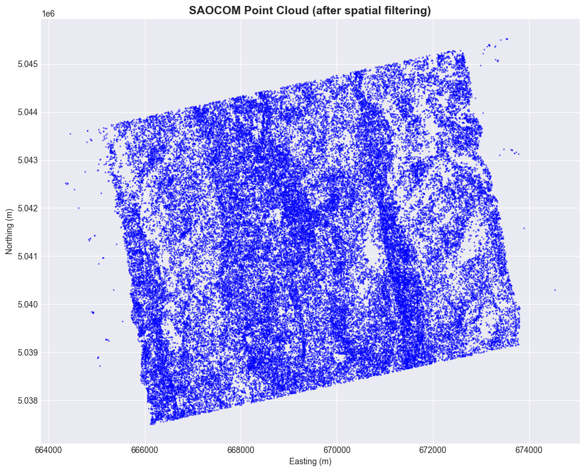
    


---
## 3. Load and Resample Reference DEMs

We need to resample both reference DEMs to a common 10m resolution to match SAOCOM's spatial resolution.


```python
# Define target grid parameters (10m resolution)
bounds = saocom_gdf.total_bounds  # [minx, miny, maxx, maxy]
RESOLUTION = 10.0  # meters

# Calculate grid dimensions
grid_width = int((bounds[2] - bounds[0]) / RESOLUTION)
grid_height = int((bounds[3] - bounds[1]) / RESOLUTION)

# Create affine transform for 10m grid
target_transform = from_bounds(
    bounds[0], bounds[1], bounds[2], bounds[3],
    grid_width, grid_height
)
target_crs = saocom_gdf.crs

print(f"Target grid: {grid_width} x {grid_height} pixels at {RESOLUTION}m resolution")
print(f"Grid bounds: {bounds}")
```

    Target grid: 1018 x 802 pixels at 10.0m resolution
    Grid bounds: [ 664353.12269539 5037504.95918495  674537.72470887 5045532.54374818]
    

### Resample TINItaly DEM (10m → 10m)


```python
# TINItaly is already 10m, but we resample to align grids
print("Resampling TINItaly DEM...")
tinitaly_10m, _ = resample_to_10m(
    src_path=TINITALY_DEM,
    output_path=TINITALY_10M,
    target_transform=target_transform,
    target_crs=target_crs,
    grid_height=grid_height,
    grid_width=grid_width
)

print(f"TINItaly resampled: {tinitaly_10m.shape}")
print(f"Saved to: {TINITALY_10M}")
```

    Resampling TINItaly DEM...
    TINItaly resampled: (802, 1018)
    Saved to: results\tinitaly_10m.tif
    

### Resample Copernicus DEM (30m → 10m)


```python
# Copernicus needs upsampling from 30m to 10m
print("Resampling Copernicus DEM...")
copernicus_10m, _ = resample_to_10m(
    src_path=COPERNICUS_DEM,
    output_path=COPERNICUS_10M,
    target_transform=target_transform,
    target_crs=target_crs,
    grid_height=grid_height,
    grid_width=grid_width
)

print(f"Copernicus resampled: {copernicus_10m.shape}")
print(f"Saved to: {COPERNICUS_10M}")
```

    Resampling Copernicus DEM...
    Copernicus resampled: (802, 1018)
    Saved to: results\copernicus_10m.tif
    

---
## 4. Sample DEMs at SAOCOM Point Locations

Extract reference DEM heights at each SAOCOM measurement point for comparison.


```python
# Convert point coordinates to raster row/col indices
rows, cols = rowcol(
    target_transform,
    saocom_gdf.geometry.x,
    saocom_gdf.geometry.y
)
rows = np.array(rows, dtype=int)
cols = np.array(cols, dtype=int)

# Check which points are within grid bounds
inbounds = (
    (rows >= 0) & (rows < grid_height) &
    (cols >= 0) & (cols < grid_width)
)

print(f"Points within grid bounds: {inbounds.sum():,} / {len(saocom_gdf):,}")
```

    Points within grid bounds: 68,504 / 68,506
    


```python
# Sample TINItaly at SAOCOM points
saocom_gdf['tinitaly_height'] = sample_raster_at_points(
    tinitaly_10m, rows, cols, inbounds, nodata=-9999
)

# Sample Copernicus at SAOCOM points
saocom_gdf['copernicus_height'] = sample_raster_at_points(
    copernicus_10m, rows, cols, inbounds, nodata=-9999
)

# Check sampling success
n_tinitaly = saocom_gdf['tinitaly_height'].notna().sum()
n_copernicus = saocom_gdf['copernicus_height'].notna().sum()

print(f"\nSuccessfully sampled:")
print(f"  TINItaly: {n_tinitaly:,} points")
print(f"  Copernicus: {n_copernicus:,} points")

# Preview sampled data
print("\nSample data:")
print(saocom_gdf[['HEIGHT_RELATIVE', 'tinitaly_height', 'copernicus_height', 'COHER']].head(10))
```

    
    Successfully sampled:
      TINItaly: 68,338 points
      Copernicus: 68,504 points
    
    Sample data:
       HEIGHT_RELATIVE  tinitaly_height  copernicus_height  COHER
    0            132.9       127.254768         128.445938   0.88
    1            112.3       106.850723         108.045143   0.86
    2            104.2       102.878250         105.200470   0.84
    3            101.6        99.962837         100.689362   0.86
    4            101.4        99.393761          99.883537   0.87
    5            102.6        99.605537         100.269646   0.86
    6            101.0        99.413490         100.024773   0.85
    7            118.5       119.067894         117.777695   0.87
    8            216.7       214.473114         220.367615   0.94
    9            223.3       218.635849         226.824966   0.95
    

---
## 5. Calibrate SAOCOM Heights

SAOCOM InSAR provides **relative** heights, not absolute elevations. We calibrate to reference DEMs using high-coherence points to estimate the vertical offset.

### Calibrate to TINItaly


```python
# Calibrate using high-coherence points (COHER >= 0.8)
print("Calibrating SAOCOM heights to TINItaly...")
offset_tin, rmse_tin, n_tin = calibrate_heights(
    saocom_gdf,
    ref_col='tinitaly_height',
    out_col='HEIGHT_ABSOLUTE_TIN',
    coherence_threshold=0.8
)

print(f"\nCalibration Results (TINItaly):")
print(f"  Offset applied: {offset_tin:.2f} m")
print(f"  RMSE: {rmse_tin:.2f} m")
print(f"  Calibration points: {n_tin:,}")

# Calculate residuals (difference after calibration)
saocom_gdf['diff_tinitaly'] = saocom_gdf['HEIGHT_ABSOLUTE_TIN'] - saocom_gdf['tinitaly_height']
```

    Calibrating SAOCOM heights to TINItaly...
    
    Calibration Results (TINItaly):
      Offset applied: 3.94 m
      RMSE: 50.17 m
      Calibration points: 67,170
    

### Calibrate to Copernicus


```python
print("Calibrating SAOCOM heights to Copernicus...")
offset_cop, rmse_cop, n_cop = calibrate_heights(
    saocom_gdf,
    ref_col='copernicus_height',
    out_col='HEIGHT_ABSOLUTE_COP',
    coherence_threshold=0.8
)

print(f"\nCalibration Results (Copernicus):")
print(f"  Offset applied: {offset_cop:.2f} m")
print(f"  RMSE: {rmse_cop:.2f} m")
print(f"  Calibration points: {n_cop:,}")

# Calculate residuals
saocom_gdf['diff_copernicus'] = saocom_gdf['HEIGHT_ABSOLUTE_COP'] - saocom_gdf['copernicus_height']
```

    Calibrating SAOCOM heights to Copernicus...
    
    Calibration Results (Copernicus):
      Offset applied: 4.70 m
      RMSE: 50.49 m
      Calibration points: 67,301
    

---
## 6. Outlier Detection

Use **Isolation Forest** machine learning algorithm to detect spatial and statistical anomalies in the residuals.


```python
# Score outliers using TINItaly residuals (more accurate reference)
print("Detecting outliers using Isolation Forest...")
saocom_scored = score_outliers_isolation_forest(
    saocom_gdf,
    residual_col='diff_tinitaly',
    contamination=0.05,  # Expect ~5% outliers
    n_estimators=100,
    random_state=42
)

print(f"Outlier scores computed for {len(saocom_scored):,} points")
print(f"Score range: [{saocom_scored['outlier_score'].min():.3f}, {saocom_scored['outlier_score'].max():.3f}]")
```

    Detecting outliers using Isolation Forest...
    Outlier scores computed for 68,506 points
    Score range: [-0.220, 0.149]
    


```python
# Filter outliers using IQR method
saocom_cleaned, outliers = filter_by_score_iqr(
    saocom_scored,
    iqr_multiplier=1  # More permissive than default (1.0)
)

print(f"\nOutlier Detection Results:")
print(f"  Original points: {len(saocom_gdf):,}")
print(f"  Outliers detected: {len(outliers):,} ({100*len(outliers)/len(saocom_gdf):.1f}%)")
print(f"  Cleaned dataset: {len(saocom_cleaned):,} points")
```

    
    Outlier Detection Results:
      Original points: 68,506
      Outliers detected: 3,857 (5.6%)
      Cleaned dataset: 64,649 points
    

### Visualize Outlier Detection Results


```python
# Generate outlier visualization
visualize_outlier_results(
    gdf_original=saocom_gdf,
    gdf_cleaned=saocom_cleaned,
    outliers=outliers,
    residual_col='diff_tinitaly',
    results_dir=RESULTS_DIR
)
```


    
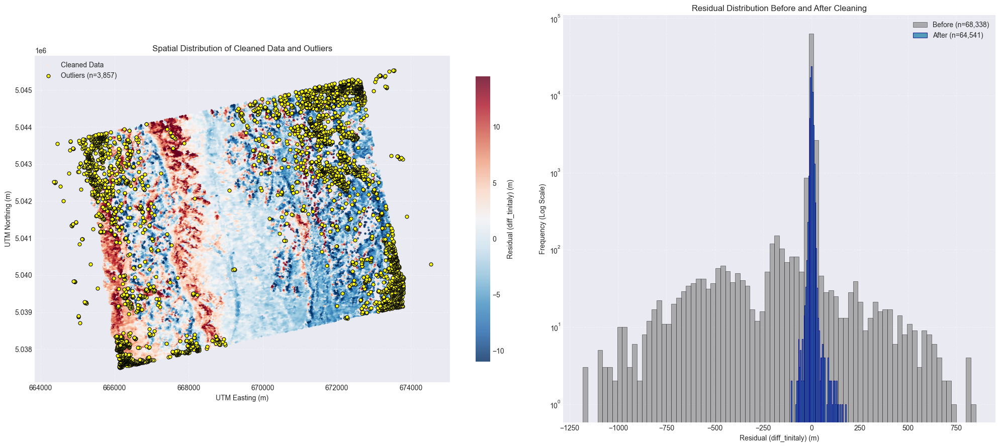
    


---

## 6. Control Points Identification

Identify high-quality control points where SAOCOM, Copernicus, and TINItaly all agree within ±2 meters.

**Purpose:**
- Validate calibration quality
- Identify stable, high-confidence locations
- Plan ground truth collection
- Independent accuracy assessment


```python
# Control Points Identification
print("### Control Points Identification ###\n")

from src.control_points import (
    identify_control_points,
    analyze_control_point_distribution,
    calculate_control_point_bias,
    recommend_calibration_points,
    export_control_points
)

# Configuration
TOLERANCE = 1  # meters
USE_CALIBRATED_SAOCOM = True

print(f"Configuration:")
print(f"  Tolerance: ±{TOLERANCE} meters")
print(f"  Using calibrated SAOCOM: {USE_CALIBRATED_SAOCOM}")
```

    ### Control Points Identification ###
    
    Configuration:
      Tolerance: ±1 meters
      Using calibrated SAOCOM: True
    


```python
# Identify control points where all three DEMs agree
control_points = identify_control_points(
    saocom_cleaned,
    tolerance=TOLERANCE,
    saocom_col='HEIGHT_RELATIVE',
    copernicus_col='copernicus_height',
    tinitaly_col='tinitaly_height',
    calibrated=USE_CALIBRATED_SAOCOM
)

print(f"\n{'='*70}")
print(f"CONTROL POINTS IDENTIFIED")
print(f"{'='*70}")
print(f"Total points: {len(saocom_cleaned):,}")
print(f"Control points: {len(control_points):,}")
print(f"Percentage: {len(control_points)/len(saocom_cleaned)*100:.2f}%")
print(f"{'='*70}\n")

if len(control_points) > 0:
    # Analyze distribution
    stats = analyze_control_point_distribution(control_points, saocom_cleaned)

    print(f"Distribution Analysis:")
    print(f"  Mean DEM agreement: {stats.get('mean_agreement', 0):.3f} m")
    print(f"  Spatial density: {stats.get('spatial_density', 0):.2f} points/km²")

    # Calculate bias at control points
    bias_stats = calculate_control_point_bias(control_points)

    print(f"\nSAOCOM Accuracy at Control Points:")
    print(f"  Bias: {bias_stats['mean_bias']:+.3f} m")
    print(f"  RMSE: {bias_stats['rmse']:.3f} m")
    print(f"  NMAD: {bias_stats['nmad']:.3f} m")
else:
    print("⚠️  No control points found with current tolerance")
```

    
    ======================================================================
    CONTROL POINTS IDENTIFIED
    ======================================================================
    Total points: 64,649
    Control points: 2,308
    Percentage: 3.57%
    ======================================================================
    
    Distribution Analysis:
      Mean DEM agreement: 0.642 m
      Spatial density: 0.00 points/km²
    
    SAOCOM Accuracy at Control Points:
      Bias: -0.016 m
      RMSE: 0.309 m
      NMAD: 0.378 m
    

---
## 7. Statistical Analysis

Compute comprehensive statistics comparing SAOCOM to both reference DEMs.


```python
# Generate complete statistical summary
generate_height_statistics_summary(saocom_cleaned, gdf_name="SAOCOM (Cleaned)")
```

    
    ===============================================================================================
     STATISTICAL SUMMARY FOR: SAOCOM (CLEANED) (64649 points)
    ===============================================================================================
    
    HEIGHT STATISTICS SUMMARY (m)
    -----------------------------------------------------------------------------------------------
                                 Dataset  Count    Min     Max   Mean  Median  Std Dev    Q25    Q75
             SAOCOM (Cleaned) (Relative)  64649 100.30 1003.20 333.28  321.00   121.70 242.20 415.80
      TINITALY (at SAOCOM (Cleaned) pts)  64541  99.54  800.65 336.33  323.76   122.18 245.92 417.71
    Copernicus (at SAOCOM (Cleaned) pts)  64649  99.97  804.60 337.95  325.28   122.67 246.76 421.35
    -----------------------------------------------------------------------------------------------
    
    DIFFERENCE STATISTICS (SAOCOM Relative - Reference DEM):
    -----------------------------------------------------------------------------------------------
    
    SAOCOM (Cleaned) - TINITALY:
      Mean: -3.390 m | Median: -3.900 m | Std: 6.580 m | RMSE: 7.402 m
    
    SAOCOM (Cleaned) - Copernicus:
      Mean: -4.664 m | Median: -4.650 m | Std: 7.166 m | RMSE: 8.550 m
    ===============================================================================================
    

### Calculate NMAD (Robust Accuracy Metric)


```python
# NMAD for TINItaly comparison
residuals_tin = saocom_cleaned['diff_tinitaly'].dropna()
nmad_tin = nmad(residuals_tin)

# NMAD for Copernicus comparison
residuals_cop = saocom_cleaned['diff_copernicus'].dropna()
nmad_cop = nmad(residuals_cop)

print("\n" + "="*60)
print("ROBUST ACCURACY METRICS (NMAD)")
print("="*60)
print(f"SAOCOM vs TINItaly:    NMAD = {nmad_tin:.2f} m  (n={len(residuals_tin):,})")
print(f"SAOCOM vs Copernicus:  NMAD = {nmad_cop:.2f} m  (n={len(residuals_cop):,})")
print("="*60)

# NMAD is preferred over RMSE for height accuracy as it's less sensitive to outliers
```

    
    ============================================================
    ROBUST ACCURACY METRICS (NMAD)
    ============================================================
    SAOCOM vs TINItaly:    NMAD = 4.89 m  (n=64,541)
    SAOCOM vs Copernicus:  NMAD = 4.64 m  (n=64,649)
    ============================================================
    

### Distribution Analysis


```python
# Create distribution comparison plots
fig, axes = plt.subplots(1, 2, figsize=(16, 6))

# TINItaly residuals
metrics_tin = {
    'n_points': len(residuals_tin),
    'mean_diff': residuals_tin.mean(),
    'rmse': np.sqrt((residuals_tin**2).mean()),
    'nmad': nmad_tin,
    'std_diff': residuals_tin.std()
}
plot_distribution_histogram(axes[0], residuals_tin, 'SAOCOM - TINItaly', metrics_tin)

# Copernicus residuals
metrics_cop = {
    'n_points': len(residuals_cop),
    'mean_diff': residuals_cop.mean(),
    'rmse': np.sqrt((residuals_cop**2).mean()),
    'nmad': nmad_cop,
    'std_diff': residuals_cop.std()
}
plot_distribution_histogram(axes[1], residuals_cop, 'SAOCOM - Copernicus', metrics_cop)

# Add grid to all axes
if isinstance(ax, np.ndarray):
    for a in ax.flat:
        a.grid(True, alpha=0.3, linestyle="--", color="gray")
else:
    ax.grid(True, alpha=0.3, linestyle="--", color="gray")

plt.tight_layout()
plt.savefig(IMAGES_DIR / 'residual_distributions.png', dpi=300, bbox_inches='tight')
plt.show()
```


    
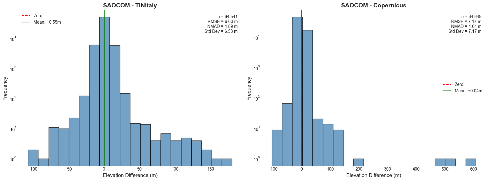
    


---
## 8. Terrain Analysis

Calculate slope and aspect from reference DEMs to understand how terrain affects InSAR accuracy.

---

## ⛰️ Terrain Characteristics Analysis

Terrain geometry significantly affects InSAR measurement quality.

**Terrain derivatives calculated:**
- **Slope** - Steepness of terrain (degrees)
- **Aspect** - Direction terrain faces (degrees from north)
- **Curvature** - Surface concavity/convexity

**Expected patterns:**
- Flat terrain (0-5°): Best accuracy
- Moderate slopes (5-30°): Good accuracy
- Steep slopes (>30°): Degraded accuracy due to foreshortening

---


```python
# Calculate slope and aspect from TINItaly
print("Calculating terrain derivatives from TINItaly...")
slope_tin, aspect_tin = calculate_terrain_derivatives(
    tinitaly_10m,
    cellsize=10,
    nodata=-9999
)

print(f"Slope range: [{np.nanmin(slope_tin):.1f}°, {np.nanmax(slope_tin):.1f}°]")
print(f"Mean slope: {np.nanmean(slope_tin):.1f}°")
```

    Calculating terrain derivatives from TINItaly...
    Slope range: [0.0°, 59.3°]
    Mean slope: 16.1°
    


```python
# Sample slope and aspect at SAOCOM cleaned points
# IMPORTANT: Must recalculate row/col indices for cleaned dataset
rows_clean, cols_clean = rowcol(    target_transform,    saocom_cleaned.geometry.x,    saocom_cleaned.geometry.y)
rows_clean = np.array(rows_clean, dtype=int)
cols_clean = np.array(cols_clean, dtype=int)
# Check bounds for cleaned dataset
inbounds_clean = (    (rows_clean >= 0) & (rows_clean < grid_height) &    (cols_clean >= 0) & (cols_clean < grid_width))
# Sample terrain derivatives
saocom_cleaned['slope_tin'] = sample_raster_at_points(    slope_tin, rows_clean, cols_clean, inbounds_clean, nodata=-9999)
saocom_cleaned['aspect_tin'] = sample_raster_at_points(    aspect_tin, rows_clean, cols_clean, inbounds_clean, nodata=-9999)
print(f"Sampled terrain derivatives for {saocom_cleaned['slope_tin'].notna().sum():,} points")
```

    Sampled terrain derivatives for 64,506 points
    

### Analyze Accuracy vs Slope


```python
# Bin residuals by slope categories
slope_bins = [0, 5, 15, 30, 90]
slope_labels = ['Flat (0-5°)', 'Gentle (5-15°)', 'Moderate (15-30°)', 'Steep (>30°)']

saocom_cleaned['slope_category'] = pd.cut(
    saocom_cleaned['slope_tin'],
    bins=slope_bins,
    labels=slope_labels
)

# Calculate NMAD by slope category
slope_stats = saocom_cleaned.groupby('slope_category')['diff_tinitaly'].agg([
    ('count', 'count'),
    ('mean', 'mean'),
    ('std', 'std'),
    ('nmad', lambda x: nmad(x.dropna()))
]).round(2)

print("\nAccuracy by Slope Category:")
print(slope_stats)
```

    
    Accuracy by Slope Category:
                       count  mean    std  nmad
    slope_category                             
    Flat (0-5°)        19181  0.33   2.82  2.11
    Gentle (5-15°)     15544 -0.09   5.88  5.62
    Moderate (15-30°)  25231  0.71   7.72  6.91
    Steep (>30°)        4550  2.86  11.16  9.03
    

---
## 9. Land Cover Analysis

Sample CORINE Land Cover to understand how different surface types affect InSAR accuracy.


```python
# Load and sample land cover
print("Loading CORINE Land Cover...")
print(CORINE_LC)
with rasterio.open(CORINE_LC) as src:
    corine_data = src.read(1)
    corine_transform = src.transform
    corine_crs = src.crs

# Load CORINE lookup table to get LABEL3
# CORINE_DBF = DATA_DIR / 'corine_clip.tif.vat.dbf'
from dbfread import DBF
dbf_table = DBF(str(CORINE_DBF), load=True)
lookup_df = pd.DataFrame(iter(dbf_table))

# Create mappings: Value -> CODE_18 and CODE_18 -> LABEL3
print(lookup_df)
value_to_code = dict(zip(lookup_df['Value'], lookup_df['CODE_18']))
code_to_label3 = dict(zip(lookup_df['CODE_18'].astype(float).astype(int), lookup_df['LABEL3']))
print(code_to_label3)
print(f"Loaded {len(code_to_label3)} CORINE land cover classes")

# Reproject SAOCOM points if needed
if saocom_cleaned.crs != corine_crs:
    saocom_lc = saocom_cleaned.to_crs(corine_crs)
else:
    saocom_lc = saocom_cleaned

# Sample land cover codes
lc_rows, lc_cols = rowcol(
    corine_transform,
    saocom_lc.geometry.x,
    saocom_lc.geometry.y
)
lc_rows = np.array(lc_rows, dtype=int)
lc_cols = np.array(lc_cols, dtype=int)

# Check bounds
lc_inbounds = (
    (lc_rows >= 0) & (lc_rows < corine_data.shape[0]) &
    (lc_cols >= 0) & (lc_cols < corine_data.shape[1])
)

# Extract raw values from raster
lc_values = np.full(len(saocom_lc), np.nan)
lc_values[lc_inbounds] = corine_data[lc_rows[lc_inbounds], lc_cols[lc_inbounds]]

# Map: Value -> CODE_18
lc_codes = np.array([value_to_code.get(int(v), 0) if pd.notna(v) else 0 for v in lc_values])

# Store both the code and the LABEL3 description
saocom_cleaned['corine_code'] = lc_codes.astype(float).astype(int)
print(saocom_cleaned)
# print([saocom_cleaned['corine_code'].iloc[0]])
saocom_cleaned['land_cover'] = saocom_cleaned['corine_code'].apply(
    lambda x: code_to_label3.get(int(x), 'Unknown') if pd.notna(x) and x > 0 else 'Unknown'
)

# Also add Level 1 categories for broader analysis
saocom_cleaned['land_cover_level1'] = saocom_cleaned['corine_code'].apply(
    lambda x: get_clc_level1(int(x)) if pd.notna(x) and x > 0 else 'Unknown'
)

print(f"Land cover sampled for {saocom_cleaned['land_cover'].notna().sum():,} points")
print(f"\nLand cover distribution (Level 1 categories):")
print(saocom_cleaned['land_cover_level1'].value_counts())
print(f"\nMost common Level 3 classes:")
print(saocom_cleaned['land_cover'].value_counts().head(10))

```

    Loading CORINE Land Cover...
    data\ground_cover\land_cover_clipped.tif
        Value      Count                                             LABEL3  \
    0       2   545460.0                         Discontinuous urban fabric   
    1       3    46000.0                     Industrial or commercial units   
    2      15  3515240.0                                          Vineyards   
    3      17   947160.0                                       Olive groves   
    4      18   994604.0                                           Pastures   
    5      20   342440.0                       Complex cultivation patterns   
    6      21  2446376.0  Land principally occupied by agriculture, with...   
    7      23  3535640.0                                Broad-leaved forest   
    8      24    92000.0                                  Coniferous forest   
    9      25    82800.0                                       Mixed forest   
    10     30   119720.0                              Beaches, dunes, sands   
    
             Red     Green      Blue CODE_18  
    0   1.000000  0.000000  0.000000     112  
    1   0.800000  0.301961  0.949020     121  
    2   0.901961  0.501961  0.000000     221  
    3   0.901961  0.650980  0.000000     223  
    4   0.901961  0.901961  0.301961     231  
    5   1.000000  0.901961  0.301961     242  
    6   0.901961  0.800000  0.301961     243  
    7   0.501961  1.000000  0.000000     311  
    8   0.000000  0.650980  0.000000     312  
    9   0.301961  1.000000  0.000000     313  
    10  0.901961  0.901961  0.901961     331  
    {112: 'Discontinuous urban fabric', 121: 'Industrial or commercial units', 221: 'Vineyards', 223: 'Olive groves', 231: 'Pastures', 242: 'Complex cultivation patterns', 243: 'Land principally occupied by agriculture, with significant areas of natural vegetation', 311: 'Broad-leaved forest', 312: 'Coniferous forest', 313: 'Mixed forest', 331: 'Beaches, dunes, sands'}
    Loaded 11 CORINE land cover classes
              ID  SVET  LVET        LAT       LAT2        LON       LON2  HEIGHT  \
    7          8   329   540  45.473982  45.473297  11.146332  11.140874   118.5   
    12        13   450   540  45.475908  45.475223  11.160802  11.155344   300.0   
    13        14   470   540  45.476093  45.475408  11.162192  11.156734   280.6   
    14        15   481   540  45.476213  45.475528  11.163091  11.157633   276.5   
    15        16   499   540  45.476389  45.475704  11.164414  11.158956   262.6   
    ...      ...   ...   ...        ...        ...        ...        ...     ...   
    68497  68504   711  2500  45.535033  45.534348  11.172723  11.167265   493.0   
    68498  68505   765  2500  45.535591  45.534906  11.176919  11.171461   463.2   
    68499  68506   909  2500  45.537333  45.536648  11.190042  11.184584   481.1   
    68500  68507   915  2500  45.537378  45.536693  11.190377  11.184919   471.2   
    68501  68508   966  2500  45.538388  45.537703  11.198015  11.192557   627.6   
    
           HEIGHT WRT DEM  SIGMA HEIGHT  ...  copernicus_height  \
    7               118.5      2.007439  ...         117.777695   
    12              300.0      1.681078  ...         300.923798   
    13              280.6      1.710371  ...         280.156128   
    14              276.5      1.703117  ...         278.046173   
    15              262.6      1.783924  ...         264.424896   
    ...               ...           ...  ...                ...   
    68497           493.0      1.824959  ...         506.526581   
    68498           463.2      1.856288  ...         468.741241   
    68499           481.1      1.950695  ...         497.275665   
    68500           471.2      1.887185  ...         476.770477   
    68501           627.6      2.048489  ...         632.855103   
    
          HEIGHT_ABSOLUTE_TIN  diff_tinitaly  HEIGHT_ABSOLUTE_COP  \
    7               122.44142       3.373526           123.202679   
    12              303.94142       3.245039           304.702679   
    13              284.54142       3.855812           285.302679   
    14              280.44142       2.591566           281.202679   
    15              266.54142       2.060005           267.302679   
    ...                   ...            ...                  ...   
    68497           496.94142     -13.101793           497.702679   
    68498           467.14142      -2.068175           467.902679   
    68499           485.04142      -2.436272           485.802679   
    68500           475.14142       6.484682           475.902679   
    68501           631.54142      -2.073875           632.302679   
    
           diff_copernicus  outlier_score  slope_tin  aspect_tin  \
    7             5.424985       0.015460   7.186925  161.050919   
    12            3.778882       0.028056  19.088104  242.355225   
    13            5.146552       0.026721   7.121970  215.570175   
    14            3.156506       0.028118   4.114086  202.987381   
    15            2.877783       0.025883   4.581378  290.335846   
    ...                ...            ...        ...         ...   
    68497        -8.823901       0.007544  12.684301  141.416840   
    68498        -0.838562       0.044065  23.811266  232.149597   
    68499       -11.472986       0.034883  42.089039  255.602051   
    68500        -0.867798       0.019482  39.239368  250.244583   
    68501        -0.552423       0.018316   8.261708  161.747452   
    
              slope_category  corine_code  
    7         Gentle (5-15°)          221  
    12     Moderate (15-30°)          221  
    13        Gentle (5-15°)          221  
    14           Flat (0-5°)          221  
    15           Flat (0-5°)          223  
    ...                  ...          ...  
    68497     Gentle (5-15°)          231  
    68498  Moderate (15-30°)          231  
    68499       Steep (>30°)          311  
    68500       Steep (>30°)          311  
    68501     Gentle (5-15°)          231  
    
    [64649 rows x 24 columns]
    Land cover sampled for 64,649 points
    
    Land cover distribution (Level 1 categories):
    land_cover_level1
    2. Agricultural Areas             42996
    3. Forest & Semi-Natural Areas    16571
    1. Artificial Surfaces             5082
    Name: count, dtype: int64
    
    Most common Level 3 classes:
    land_cover
    Vineyards                                                                                 21563
    Broad-leaved forest                                                                       13443
    Land principally occupied by agriculture, with significant areas of natural vegetation    11139
    Pastures                                                                                   5977
    Discontinuous urban fabric                                                                 5082
    Complex cultivation patterns                                                               2478
    Olive groves                                                                               1839
    Beaches, dunes, sands                                                                      1614
    Coniferous forest                                                                          1260
    Mixed forest                                                                                254
    Name: count, dtype: int64
    

---

## 🌳 Land Cover Classification

Surface type affects radar backscatter and measurement quality.

**CORINE Land Cover hierarchy:**
- **Level 1**: Broad categories (Urban, Agricultural, Forest, Water, Wetlands)
- **Level 2**: Sub-categories (e.g., Arable land, Permanent crops)
- **Level 3**: Detailed classes (e.g., Vineyards, Olive groves)

**Analysis approach:**
1. Sample CORINE raster at SAOCOM point locations
2. Decode numeric codes using DBF lookup table
3. Stratify accuracy metrics by land cover type

**Expected patterns:**
- Urban areas: Moderate to good (stable surfaces)
- Agricultural: Variable (depends on vegetation)
- Forests: Lower coherence (temporal decorrelation)
- Water: Poor or no valid measurements

---


---

## 8. Radar Shadow and Geometry Analysis

Analyze radar geometry effects including shadow, layover, and foreshortening.

**Purpose:**
- Identify areas affected by poor radar geometry
- Stratify accuracy by geometric quality
- Understand spatial patterns in errors
- Mask unreliable shadow/layover areas


```python
# Radar Shadow Analysis
print("### Radar Shadow Analysis ###\n")

from src.radar_geometry import (
    calculate_local_incidence_angle,
    identify_shadow_areas,
    identify_layover_areas,
    classify_geometric_quality,
    analyze_shadow_statistics
)

# SAOCOM geometry parameters
RADAR_INCIDENCE = 35.0  # degrees from vertical
RADAR_AZIMUTH = 192.0   # degrees (192° = descending, 12° = ascending)

print(f"SAOCOM Geometry:")
print(f"  Incidence angle: {RADAR_INCIDENCE}°")
print(f"  Look azimuth: {RADAR_AZIMUTH}° ({'Descending' if RADAR_AZIMUTH > 90 else 'Ascending'})")
```

    ### Radar Shadow Analysis ###
    
    SAOCOM Geometry:
      Incidence angle: 35.0°
      Look azimuth: 192.0° (Descending)
    


```python
# Calculate local incidence angle from slope and aspect
print("\nCalculating local incidence angles...")

local_incidence = calculate_local_incidence_angle(
    slope_tin,
    aspect_tin,
    radar_incidence=RADAR_INCIDENCE,
    radar_azimuth=RADAR_AZIMUTH
)

# Identify shadow and layover
shadow_mask = identify_shadow_areas(local_incidence)
layover_mask = identify_layover_areas(local_incidence)

# Classify geometric quality
geometric_quality = classify_geometric_quality(local_incidence, slope_tin)

print(f"\nGeometric Quality Distribution:")
total_pixels = np.sum(~np.isnan(local_incidence))
print(f"  Shadow: {np.sum(shadow_mask)/total_pixels*100:.2f}% of area")
print(f"  Layover: {np.sum(layover_mask)/total_pixels*100:.2f}% of area")

quality_names = ['Optimal', 'Acceptable', 'Foreshortening', 'Shadow', 'Layover']
for i, name in enumerate(quality_names):
    pct = np.sum(geometric_quality == i) / total_pixels * 100
    print(f"  {name}: {pct:.2f}% of area")
```

    
    Calculating local incidence angles...
    
    Geometric Quality Distribution:
      Shadow: 0.00% of area
      Layover: 9.49% of area
      Optimal: 59.03% of area
      Acceptable: 37.00% of area
      Foreshortening: 8.86% of area
      Shadow: 0.00% of area
      Layover: 9.49% of area
    


```python
# Sample geometric data at SAOCOM point locations
print("\nSampling geometric data at SAOCOM points...")

from rasterio.transform import rowcol

def sample_raster_at_points(gdf, raster_array, transform):
    """Sample raster values at point locations."""
    values = []
    for geom in gdf.geometry:
        row, col = rowcol(transform, geom.x, geom.y)
        if (0 <= row < raster_array.shape[0] and 0 <= col < raster_array.shape[1]):
            values.append(raster_array[row, col])
        else:
            values.append(np.nan)
    return np.array(values)

# Sample at cleaned points
saocom_cleaned['local_incidence'] = sample_raster_at_points(
    saocom_cleaned, local_incidence, target_transform
)
saocom_cleaned['is_shadow'] = sample_raster_at_points(
    saocom_cleaned, shadow_mask.astype(float), target_transform
).astype(bool)
saocom_cleaned['geometric_quality'] = sample_raster_at_points(
    saocom_cleaned, geometric_quality, target_transform
).astype(int)

print(f"Points in shadow: {saocom_cleaned['is_shadow'].sum()} "
      f"({saocom_cleaned['is_shadow'].sum()/len(saocom_cleaned)*100:.1f}%)")
```

    
    Sampling geometric data at SAOCOM points...
    Points in shadow: 0 (0.0%)
    


```python
# Analyze accuracy stratified by geometric quality
shadow_stats = analyze_shadow_statistics(
    saocom_cleaned,
    local_incidence_col='local_incidence',
    residual_col='diff_tinitaly'
)

print(f"\n{'='*70}")
print(f"ACCURACY BY RADAR GEOMETRY")
print(f"{'='*70}")
print(f"{'Category':<15} {'Count':>8} {'Bias (m)':>10} {'RMSE (m)':>10} {'NMAD (m)':>10}")
print("-" * 70)

for category, stats in shadow_stats.items():
    if stats['count'] > 0:
        print(f"{category:<15} {stats['count']:>8} "
              f"{stats['bias']:>10.2f} {stats['rmse']:>10.2f} {stats['nmad']:>10.2f}")

print(f"{'='*70}\n")
```

    
    ======================================================================
    ACCURACY BY RADAR GEOMETRY
    ======================================================================
    Category           Count   Bias (m)   RMSE (m)   NMAD (m)
    ----------------------------------------------------------------------
    optimal            45485       0.65       6.22       4.33
    acceptable         58689       0.62       6.58       4.81
    steep                 10       8.54      11.12       6.40
    layover             5807      -0.12       6.80       5.67
    ======================================================================
    
    


```python
# Visualize radar geometry
from matplotlib.colors import LinearSegmentedColormap
import matplotlib.patches as mpatches

fig, axes = plt.subplots(1, 2, figsize=(16, 6))

# Plot 1: Local incidence angle
im1 = axes[0].imshow(local_incidence, cmap='RdYlGn_r', vmin=0, vmax=90)
axes[0].set_title('Local Incidence Angle', fontsize=14, fontweight='bold')
axes[0].set_xlabel('Column')
axes[0].set_ylabel('Row')
plt.colorbar(im1, ax=axes[0], label='Angle (degrees)')

# Shadow overlay
shadow_overlay = np.where(shadow_mask, 1, np.nan)
axes[0].imshow(shadow_overlay, cmap='binary', alpha=0.6)

# Plot 2: Geometric quality
quality_colors = ['#2ecc71', '#f39c12', '#e74c3c', '#34495e', '#9b59b6']
quality_cmap = LinearSegmentedColormap.from_list('quality', quality_colors, N=5)

im2 = axes[1].imshow(geometric_quality, cmap=quality_cmap, vmin=0, vmax=4)
axes[1].set_title('Radar Geometric Quality', fontsize=14, fontweight='bold')
axes[1].set_xlabel('Column')
axes[1].set_ylabel('Row')

patches = [mpatches.Patch(color=quality_colors[i], label=quality_names[i])
           for i in range(5)]
axes[1].legend(handles=patches, loc='upper right', fontsize=10)

plt.tight_layout()
plt.savefig('images/radar_geometry_analysis.png', dpi=300, bbox_inches='tight')
print("✓ Saved: images/radar_geometry_analysis.png")
plt.show()
```

    ✓ Saved: images/radar_geometry_analysis.png
    


    
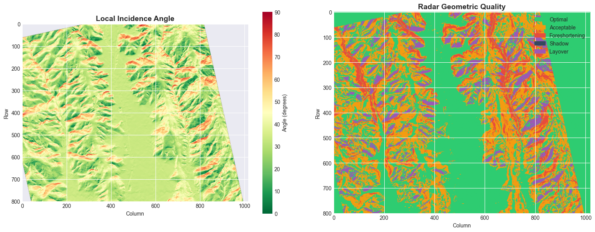
    


### Accuracy by Land Cover Type


```python
# Calculate statistics by land cover
lc_stats = saocom_cleaned.groupby('land_cover')['diff_tinitaly'].agg([
    ('count', 'count'),
    ('mean', 'mean'),
    ('std', 'std'),
    ('nmad', lambda x: nmad(x.dropna()))
]).round(2)

print("\nAccuracy by Land Cover Type:")
print(lc_stats)

# Visualize
fig, ax = plt.subplots(figsize=(12, 6))
lc_stats['nmad'].plot(kind='bar', ax=ax, color='steelblue', edgecolor='black')
ax.set_title('SAOCOM Accuracy (NMAD) by Land Cover Type', fontsize=14, fontweight='bold')
ax.set_xlabel('Land Cover Category', fontsize=12)
ax.set_ylabel('NMAD (m)', fontsize=12)
ax.grid(axis='y', alpha=0.3)
plt.xticks(rotation=45, ha='right')
plt.tight_layout()
plt.savefig(IMAGES_DIR / 'accuracy_by_landcover.png', dpi=300, bbox_inches='tight')
plt.show()
```

    
    Accuracy by Land Cover Type:
                                                        count  mean   std  nmad
    land_cover                                                                 
    Beaches, dunes, sands                                1614 -1.01  1.98  1.70
    Broad-leaved forest                                 13432  2.78  9.92  8.02
    Complex cultivation patterns                         2478  0.80  3.15  2.28
    Coniferous forest                                    1260  1.44  6.41  5.93
    Discontinuous urban fabric                           5082  1.15  3.33  2.33
    Land principally occupied by agriculture, with ...  11092 -0.49  7.19  6.84
    Mixed forest                                          254  0.19  5.79  5.07
    Olive groves                                         1839 -4.55  4.54  2.88
    Pastures                                             5927 -1.68  5.42  4.35
    Vineyards                                           21563  0.65  4.18  3.49
    


    
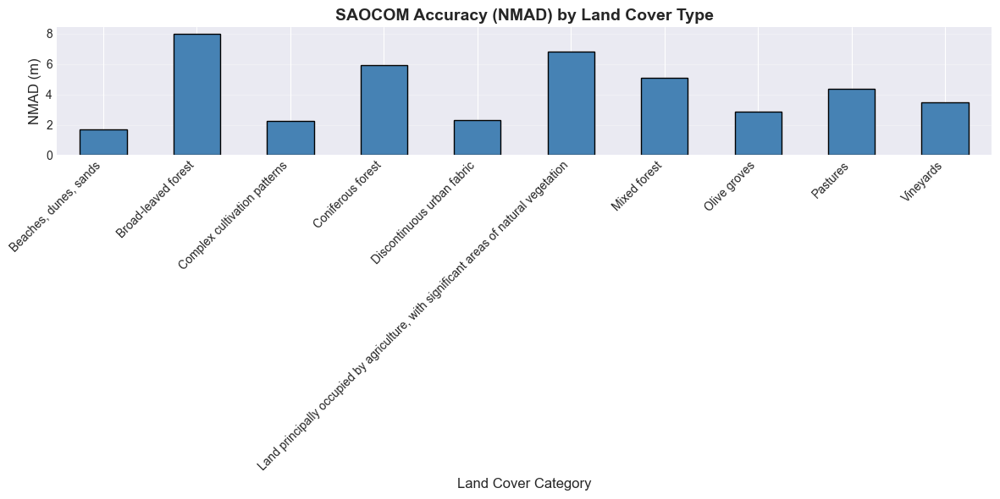
    


### 9.2 Land Cover Spatial Map

Visualize the spatial distribution of SAOCOM points by land cover type.


```python
# Create land cover map with SAOCOM points
print("Creating land cover spatial map...")

from matplotlib.patches import Rectangle
from matplotlib_scalebar.scalebar import ScaleBar
import matplotlib.patches as mpatches

# Get most common land cover classes for legend
top_lc = saocom_cleaned['land_cover'].value_counts().head(10)

# Create color map for land cover types
lc_colors = plt.cm.tab20(np.linspace(0, 1, len(top_lc)))
lc_color_map = dict(zip(top_lc.index, lc_colors))

fig, ax = plt.subplots(figsize=(16, 14))

# Plot points by land cover
for lc_type in top_lc.index:
    lc_subset = saocom_cleaned[saocom_cleaned['land_cover'] == lc_type]
    ax.scatter(lc_subset.geometry.x, lc_subset.geometry.y,
               c=[lc_color_map[lc_type]], s=5, alpha=0.6, label=lc_type)

# Add bounding box
bounds = saocom_cleaned.total_bounds
rect = Rectangle((bounds[0], bounds[1]),
                 bounds[2] - bounds[0],
                 bounds[3] - bounds[1],
                 linewidth=3, edgecolor='red', facecolor='none',
                 label='Study Area')
ax.add_patch(rect)

# Add map elements
ax.set_xlabel('UTM Easting (m)', fontsize=12, fontweight='bold')
ax.set_ylabel('UTM Northing (m)', fontsize=12, fontweight='bold')

# Add hull bounding box
hull = saocom_cleaned.geometry.unary_union.convex_hull
hull_gdf = gpd.GeoDataFrame(geometry=[hull], crs=saocom_cleaned.crs)
hull_gdf.boundary.plot(ax=ax, color='red', linewidth=2, linestyle='--', label='Study Area Hull')

ax.set_title('SAOCOM Points by Land Cover Type (Top 10 Classes)',
             fontsize=14, fontweight='bold')
ax.grid(True, alpha=0.3, linestyle='--')
# Set proper bounds with margin
bounds = saocom_cleaned.total_bounds
margin_x = (bounds[2] - bounds[0]) * 0.05
margin_y = (bounds[3] - bounds[1]) * 0.05
ax.set_xlim(bounds[0] - margin_x, bounds[2] + margin_x)
ax.set_ylim(bounds[1] - margin_y, bounds[3] + margin_y)

ax.set_aspect('equal')

# Add scale bar
scalebar = ScaleBar(1, 'm', length_fraction=0.25, location='lower right',
                    box_alpha=0.7, scale_loc='top')
ax.add_artist(scalebar)

# Add north arrow (simple style)
ax.annotate('', xy=(0.95, 0.95), xytext=(0.95, 0.85),
            xycoords='axes fraction', fontsize=20,
            arrowprops=dict(arrowstyle='->', lw=2.5, color='black'),
            annotation_clip=False)
ax.text(0.95, 0.82, 'N', transform=ax.transAxes,
         fontsize=14, fontweight='bold', ha='center', va='top',
         bbox=dict(boxstyle='round,pad=0.3', facecolor='white', edgecolor='black', linewidth=1.5))

# Legend outside plot area
ax.legend(bbox_to_anchor=(1.05, 1), loc='upper left', fontsize=9, framealpha=0.9,
          markerscale=3)  # Make legend markers 3x larger

plt.tight_layout()
plt.savefig(IMAGES_DIR / 'land_cover_map.png', dpi=300, bbox_inches='tight')
plt.show()

print(f"[OK] Saved land_cover_map.png")

```

    Creating land cover spatial map...
    


    
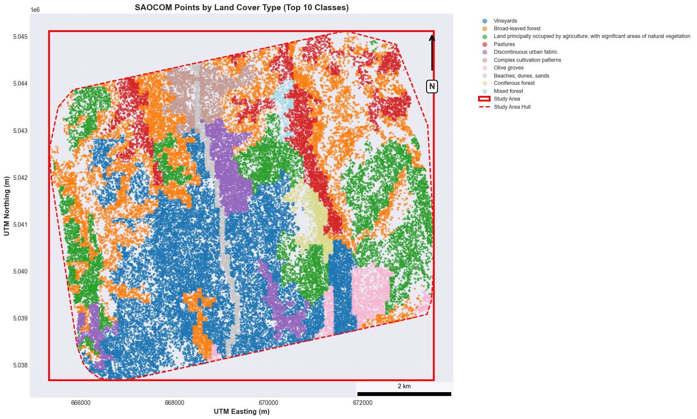
    


    [OK] Saved land_cover_map.png
    

### 9.3 Individual Land Cover Maps with Sentinel-2 Background

Generate detailed maps for each major land cover type showing:
- Sentinel-2 RGB imagery as background
- Points for that specific land cover type
- Bounding box with white fill showing extent
- All standard map elements (scale bar, north arrow, grid)


```python
# Create individual land cover maps with Sentinel-2 background
print("Creating individual land cover maps with Sentinel-2 background...")

import rasterio
from rasterio.warp import calculate_default_transform, reproject, Resampling
from matplotlib.patches import Rectangle
from matplotlib_scalebar.scalebar import ScaleBar

# Load Sentinel-2 imagery


print(f"Loading Sentinel-2 imagery from {SENTINEL_PATH}...")
with rasterio.open(SENTINEL_PATH) as src:
    sentinel_data = src.read()  # Read all bands
    sentinel_bounds = src.bounds
    sentinel_crs = src.crs
    sentinel_transform = src.transform

    # Get RGB bands (assuming bands 1,2,3 are RGB or need to pick specific bands)
    # For Sentinel-2, often need to pick bands and scale
    if src.count >= 3:
        # Read first 3 bands as RGB
        rgb = np.dstack([src.read(i) for i in range(1, 4)])

        # Normalize to 0-1 range for display
        rgb_normalized = np.zeros_like(rgb, dtype=np.float32)
        for i in range(3):
            band = rgb[:, :, i]
            # Clip to reasonable percentiles to avoid extreme values
            p2, p98 = np.percentile(band[band > 0], [2, 98])
            rgb_normalized[:, :, i] = np.clip((band - p2) / (p98 - p2), 0, 1)

print(f"Sentinel-2 image loaded: {rgb.shape[0]} x {rgb.shape[1]} pixels")
print(f"Bounds: {sentinel_bounds}")

# Reproject Sentinel-2 extent to match SAOCOM data CRS (EPSG:32632)
from rasterio.warp import transform_bounds
sentinel_extent_utm = transform_bounds(sentinel_crs, 'EPSG:32632',
                                       sentinel_bounds.left, sentinel_bounds.bottom,
                                       sentinel_bounds.right, sentinel_bounds.top)

# Calculate extent for imshow in UTM coordinates
sentinel_extent = [
    sentinel_extent_utm[0],  # left
    sentinel_extent_utm[2],  # right
    sentinel_extent_utm[1],  # bottom
    sentinel_extent_utm[3]   # top
]

print(f"Sentinel-2 extent (original CRS): {sentinel_bounds}")
print(f"Sentinel-2 extent (UTM 32N): {sentinel_extent}")

# Get top land cover types (minimum 500 points for meaningful visualization)
lc_counts = saocom_cleaned['land_cover'].value_counts()
top_lc_types = lc_counts[lc_counts >= 500].head(8).index

print(f"\nCreating maps for {len(top_lc_types)} land cover types with >= 500 points:")
for lc_type in top_lc_types:
    print(f"  - {lc_type}: {lc_counts[lc_type]:,} points")

# Create individual map for each land cover type
for idx, lc_type in enumerate(top_lc_types):
    print(f"\nCreating map {idx+1}/{len(top_lc_types)}: {lc_type}")

    # Filter points for this land cover type
    lc_subset = saocom_cleaned[saocom_cleaned['land_cover'] == lc_type].copy()

    # Get bounding box for this land cover type
    lc_bounds = lc_subset.total_bounds

    # Add margin
    margin_x = (lc_bounds[2] - lc_bounds[0]) * 0.15
    margin_y = (lc_bounds[3] - lc_bounds[1]) * 0.15

    # Create figure
    fig, ax = plt.subplots(figsize=(14, 12))

    # Display Sentinel-2 as background
    ax.imshow(rgb_normalized, extent=sentinel_extent, origin='upper', zorder=0)

    # Add white-filled bounding box for this land cover type
    bbox_rect = Rectangle(
        (lc_bounds[0], lc_bounds[1]),
        lc_bounds[2] - lc_bounds[0],
        lc_bounds[3] - lc_bounds[1],
        linewidth=3,
        edgecolor='red',
        facecolor='white',
        alpha=0.4,
        zorder=1,
        label=f'{lc_type} Extent'
    )
    ax.add_patch(bbox_rect)

    # Plot points for this land cover type
    ax.scatter(
        lc_subset.geometry.x,
        lc_subset.geometry.y,
        c='blue',
        s=20,
        alpha=0.7,
        edgecolors='white',
        linewidth=0.5,
        zorder=2,
        label=f'{lc_type} Points (n={len(lc_subset):,})'
    )

    # Add hull boundary for ALL SAOCOM data (for context)
    hull = saocom_cleaned.geometry.unary_union.convex_hull
    hull_gdf = gpd.GeoDataFrame(geometry=[hull], crs=saocom_cleaned.crs)
    hull_gdf.boundary.plot(
        ax=ax,
        color='yellow',
        linewidth=2,
        linestyle='--',
        label='Full Study Area',
        zorder=1
    )

    # Set map extent to land cover bounding box with margin
    ax.set_xlim(lc_bounds[0] - margin_x, lc_bounds[2] + margin_x)
    ax.set_ylim(lc_bounds[1] - margin_y, lc_bounds[3] + margin_y)

    # Map elements
    ax.set_xlabel('UTM Easting (m)', fontsize=12, fontweight='bold')
    ax.set_ylabel('UTM Northing (m)', fontsize=12, fontweight='bold')
    ax.set_title(f'Land Cover: {lc_type}\n({len(lc_subset):,} SAOCOM points)',
                 fontsize=14, fontweight='bold', pad=20)
    ax.grid(True, alpha=0.5, linestyle='--', color='white', linewidth=1.5)
    ax.set_aspect('equal')

    # Add scale bar
    scalebar = ScaleBar(1, 'm', length_fraction=0.25, location='lower right',
                        box_alpha=0.8, scale_loc='top', color='black',
                        box_color='white')
    ax.add_artist(scalebar)

# Add north arrow (simple style)
ax.annotate('', xy=(0.95, 0.95), xytext=(0.95, 0.85),
            xycoords='axes fraction', fontsize=20,
            arrowprops=dict(arrowstyle='->', lw=2.5, color='black'),
            annotation_clip=False)
ax.text(0.95, 0.82, 'N', transform=ax.transAxes,
         fontsize=14, fontweight='bold', ha='center', va='top',
         bbox=dict(boxstyle='round,pad=0.3', facecolor='white', edgecolor='black', linewidth=1.5))


    # Legend
ax.legend(loc='upper left', fontsize=10, framealpha=0.9,
              edgecolor='black', facecolor='white')

plt.tight_layout()

# Save with safe filename (replace spaces/slashes)
safe_filename = lc_type.replace(' ', '_').replace('/', '_').replace('\\', '_')
plt.savefig(IMAGES_DIR / f'land_cover_{safe_filename}.png', dpi=300, bbox_inches='tight')
plt.close()

print(f"  [OK] Saved land_cover_{safe_filename}.png")

print(f"\n[OK] Created {len(top_lc_types)} individual land cover maps with Sentinel-2 background")

```

    Creating individual land cover maps with Sentinel-2 background...
    Loading Sentinel-2 imagery from data\sentinel_data\Sentinel2Views_Clip.tif...
    Sentinel-2 image loaded: 1632 x 1630 pixels
    Bounds: BoundingBox(left=1234161.3784000017, bottom=5692887.081200004, right=1250461.3784000017, top=5709207.081200004)
    Sentinel-2 extent (original CRS): BoundingBox(left=1234161.3784000017, bottom=5692887.081200004, right=1250461.3784000017, top=5709207.081200004)
    Sentinel-2 extent (UTM 32N): [662866.7409038246, 674612.8517582936, 5035228.899542359, 5046951.892862969]
    
    Creating maps for 8 land cover types with >= 500 points:
      - Vineyards: 21,563 points
      - Broad-leaved forest: 13,443 points
      - Land principally occupied by agriculture, with significant areas of natural vegetation: 11,139 points
      - Pastures: 5,977 points
      - Discontinuous urban fabric: 5,082 points
      - Complex cultivation patterns: 2,478 points
      - Olive groves: 1,839 points
      - Beaches, dunes, sands: 1,614 points
    
    Creating map 1/8: Vineyards
    
    Creating map 2/8: Broad-leaved forest
    
    Creating map 3/8: Land principally occupied by agriculture, with significant areas of natural vegetation
    
    Creating map 4/8: Pastures
    
    Creating map 5/8: Discontinuous urban fabric
    
    Creating map 6/8: Complex cultivation patterns
    
    Creating map 7/8: Olive groves
    
    Creating map 8/8: Beaches, dunes, sands
      [OK] Saved land_cover_Beaches,_dunes,_sands.png
    
    [OK] Created 8 individual land cover maps with Sentinel-2 background
    


    
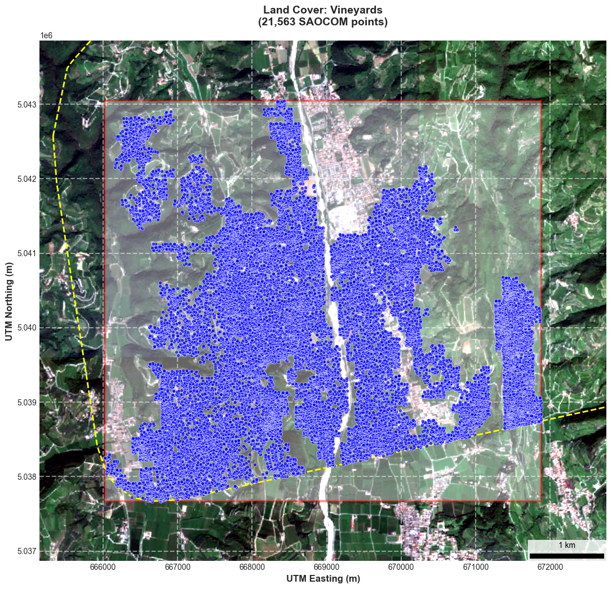
    


    
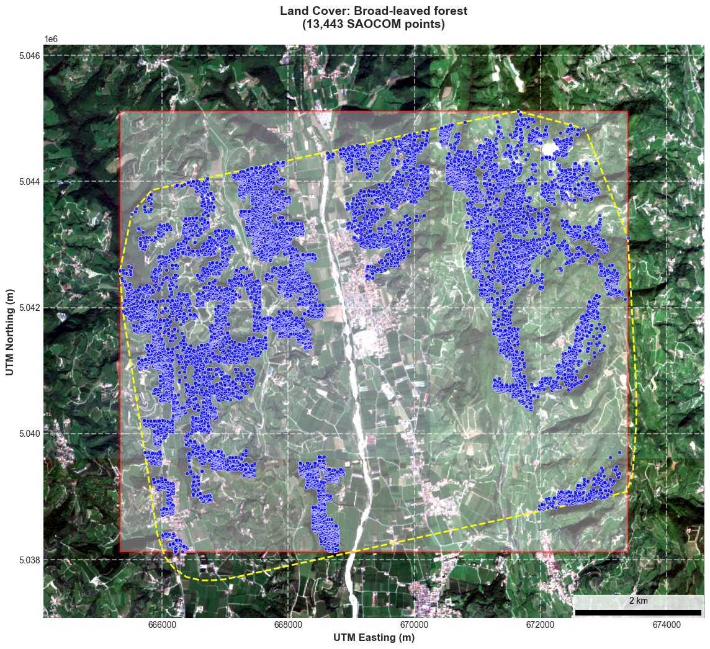
    


    
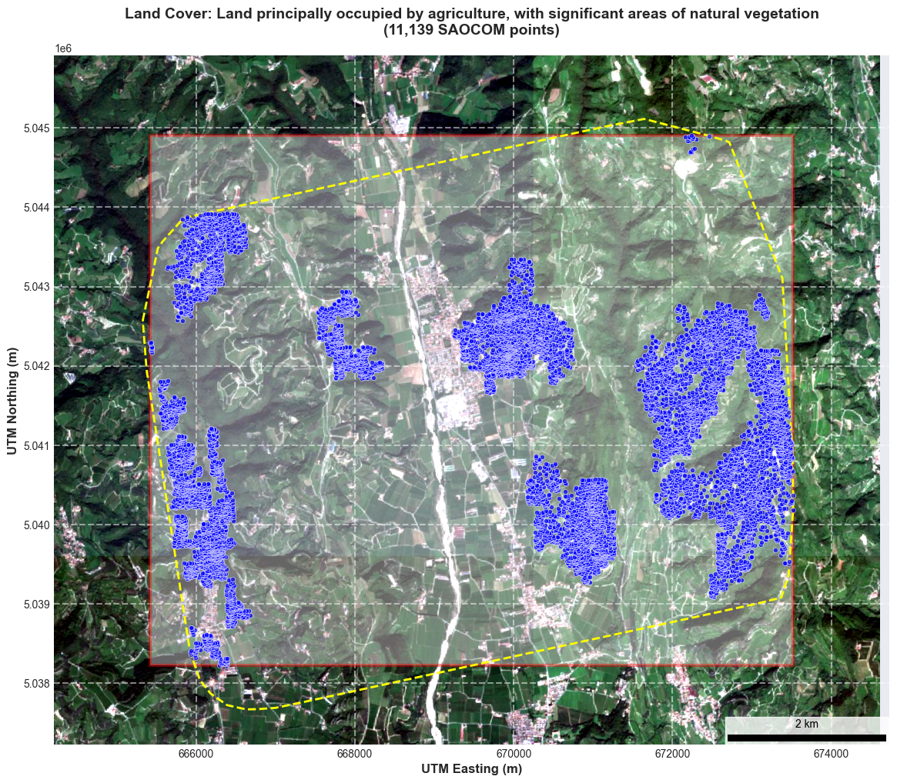
    


    
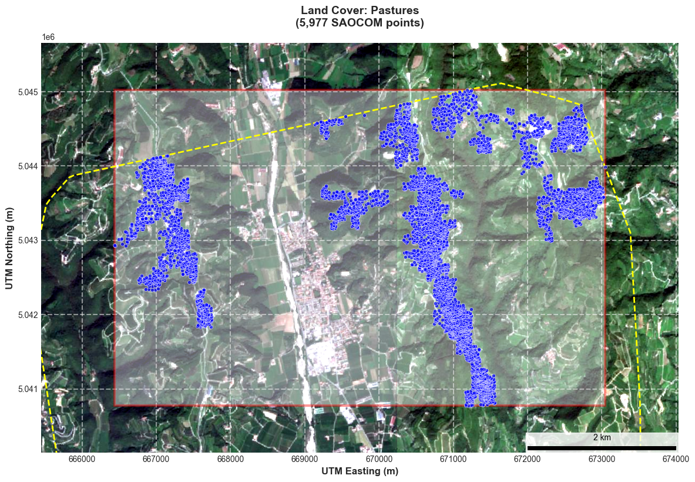
    


    
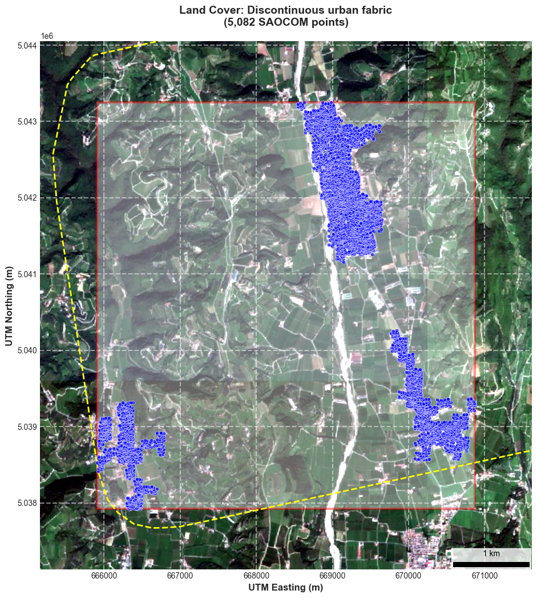
    


    
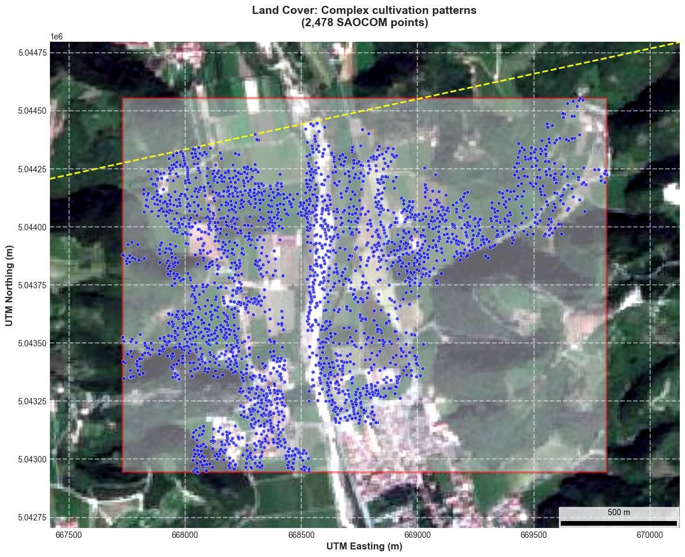
    


    
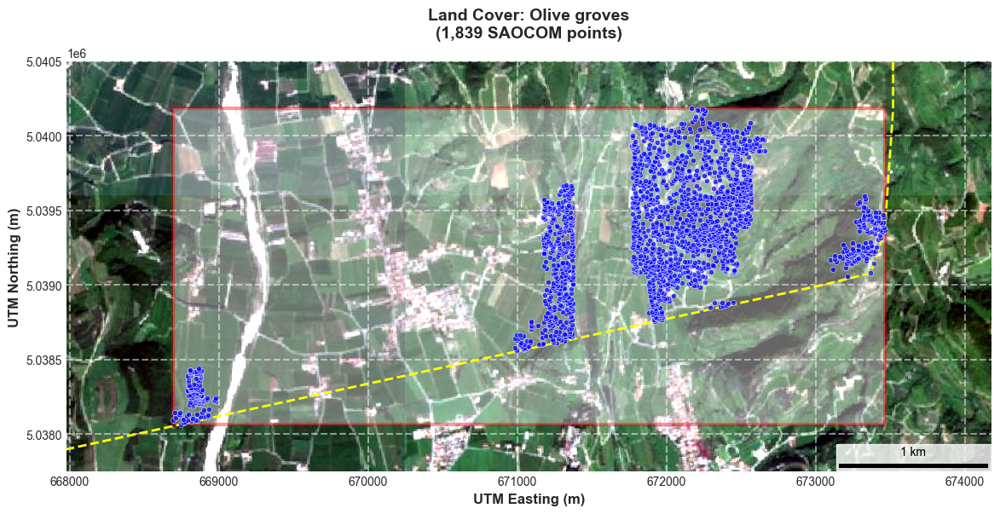
    


### 9.3 Land Cover Distribution Histograms

Detailed distribution of SAOCOM points across land cover classes at different hierarchical levels.


```python
# Land cover histograms at different levels
print("Creating land cover histograms...")

fig, axes = plt.subplots(2, 1, figsize=(16, 12))

# Level 1 (broad categories)
lc_level1_counts = saocom_cleaned['land_cover_level1'].value_counts()
axes[0].barh(range(len(lc_level1_counts)), lc_level1_counts.values, color='steelblue', edgecolor='black')
axes[0].set_yticks(range(len(lc_level1_counts)))
axes[0].set_yticklabels(lc_level1_counts.index)
axes[0].set_xlabel('Number of Points', fontsize=12, fontweight='bold')
axes[0].set_title('Land Cover Distribution - Level 1 (Broad Categories)',
                  fontsize=13, fontweight='bold')
axes[0].grid(axis='x', alpha=0.3)

# Add percentage labels
total = lc_level1_counts.sum()
for i, v in enumerate(lc_level1_counts.values):
    pct = 100 * v / total
    axes[0].text(v, i, f'  {v:,} ({pct:.1f}%)', va='center', fontweight='bold')

# Level 3 (detailed classes) - top 15
lc_level3_counts = saocom_cleaned['land_cover'].value_counts().head(15)
axes[1].barh(range(len(lc_level3_counts)), lc_level3_counts.values, color='coral', edgecolor='black')
axes[1].set_yticks(range(len(lc_level3_counts)))
axes[1].set_yticklabels(lc_level3_counts.index)
axes[1].set_xlabel('Number of Points', fontsize=12, fontweight='bold')
axes[1].set_title('Land Cover Distribution - Level 3 (Top 15 Detailed Classes)',
                  fontsize=13, fontweight='bold')
axes[1].grid(axis='x', alpha=0.3)

# Add count labels
for i, v in enumerate(lc_level3_counts.values):
    axes[1].text(v, i, f'  {v:,}', va='center', fontweight='bold')

plt.tight_layout()
plt.savefig(IMAGES_DIR / 'land_cover_histograms.png', dpi=300, bbox_inches='tight')
plt.show()

print(f"[OK] Saved land_cover_histograms.png")

```

    Creating land cover histograms...
    


    
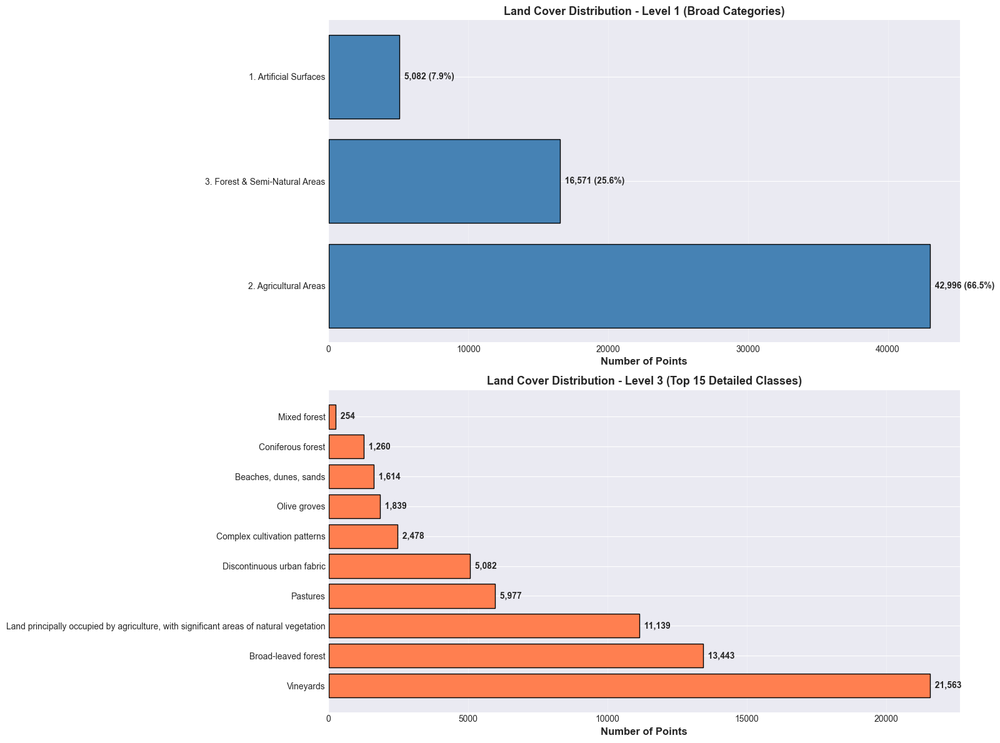
    


    [OK] Saved land_cover_histograms.png
    

### 9.4 SAOCOM Accuracy by Detailed Land Cover Classes

Analyze how InSAR accuracy varies across specific land cover types (Level 3).


```python
# Accuracy metrics by detailed land cover classes
print("Analyzing accuracy by detailed land cover classes...")

# Calculate statistics for classes with sufficient points
MIN_POINTS = 100
lc_detailed_stats = saocom_cleaned.groupby('land_cover').agg(
    count=('diff_tinitaly', 'count'),
    mean=('diff_tinitaly', 'mean'),
    std=('diff_tinitaly', 'std'),
    nmad=('diff_tinitaly', lambda x: nmad(x.dropna()))
).reset_index()

# Filter to classes with enough points
lc_detailed_stats = lc_detailed_stats[lc_detailed_stats['count'] >= MIN_POINTS].copy()
lc_detailed_stats = lc_detailed_stats.sort_values('nmad')

print(f"\nAccuracy by Land Cover (classes with >= {MIN_POINTS} points):")
print(lc_detailed_stats.to_string(index=False))

# Visualize
fig, axes = plt.subplots(1, 2, figsize=(18, 8))

# NMAD by land cover
axes[0].barh(range(len(lc_detailed_stats)), lc_detailed_stats['nmad'],
             color='steelblue', edgecolor='black')
axes[0].set_yticks(range(len(lc_detailed_stats)))
axes[0].set_yticklabels(lc_detailed_stats['land_cover'], fontsize=9)
axes[0].set_xlabel('NMAD (m)', fontsize=12, fontweight='bold')
axes[0].set_title('InSAR Accuracy (NMAD) by Land Cover Type',
                  fontsize=13, fontweight='bold')
axes[0].axvline(x=nmad_tin, color='red', linestyle='--', linewidth=2,
                label=f'Overall NMAD = {nmad_tin:.2f} m')
axes[0].grid(axis='x', alpha=0.3)
axes[0].legend()

# Add NMAD values
for i, v in enumerate(lc_detailed_stats['nmad']):
    axes[0].text(v, i, f'  {v:.2f}', va='center', fontweight='bold')

# Point count by land cover
axes[1].barh(range(len(lc_detailed_stats)), lc_detailed_stats['count'],
             color='coral', edgecolor='black')
axes[1].set_yticks(range(len(lc_detailed_stats)))
axes[1].set_yticklabels(lc_detailed_stats['land_cover'], fontsize=9)
axes[1].set_xlabel('Number of Points', fontsize=12, fontweight='bold')
axes[1].set_title('Sample Size by Land Cover Type',
                  fontsize=13, fontweight='bold')
axes[1].grid(axis='x', alpha=0.3)

# Add count labels
for i, v in enumerate(lc_detailed_stats['count']):
    axes[1].text(v, i, f'  {v:,}', va='center', fontweight='bold')

plt.tight_layout()
plt.savefig(IMAGES_DIR / 'accuracy_by_detailed_land_cover.png', dpi=300, bbox_inches='tight')
plt.show()

print(f"[OK] Saved accuracy_by_detailed_land_cover.png")

```

    Analyzing accuracy by detailed land cover classes...
    
    Accuracy by Land Cover (classes with >= 100 points):
                                                                                land_cover  count      mean      std     nmad
                                                                     Beaches, dunes, sands   1614 -1.005125 1.979000 1.699816
                                                              Complex cultivation patterns   2478  0.803116 3.154902 2.281357
                                                                Discontinuous urban fabric   5082  1.147277 3.333580 2.328444
                                                                              Olive groves   1839 -4.547896 4.538148 2.876284
                                                                                 Vineyards  21563  0.645226 4.181583 3.486246
                                                                                  Pastures   5927 -1.681467 5.418001 4.349464
                                                                              Mixed forest    254  0.188817 5.787738 5.066775
                                                                         Coniferous forest   1260  1.438213 6.411823 5.926047
    Land principally occupied by agriculture, with significant areas of natural vegetation  11092 -0.485697 7.190105 6.836714
                                                                       Broad-leaved forest  13432  2.780670 9.919050 8.015759
    


    
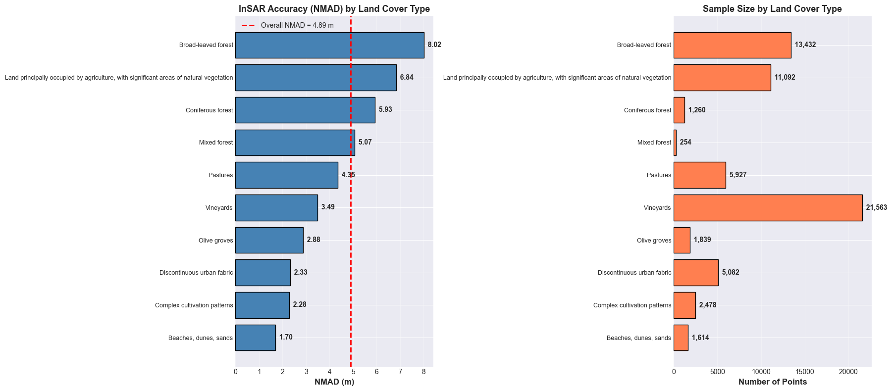
    


    [OK] Saved accuracy_by_detailed_land_cover.png
    

### 9.5 Land Cover vs Terrain Characteristics

Explore the relationship between land cover types and terrain characteristics (slope).


```python
# Land cover vs slope analysis
print("Analyzing land cover vs terrain slope...")

# Get top land cover classes
top_lc_classes = saocom_cleaned['land_cover'].value_counts().head(8).index

# Filter data
lc_slope_data = saocom_cleaned[saocom_cleaned['land_cover'].isin(top_lc_classes)].copy()

fig, axes = plt.subplots(1, 2, figsize=(18, 8))

# Violin plot: Slope distribution by land cover
plot_data_violin = [lc_slope_data[lc_slope_data['land_cover'] == lc]['slope_tin'].dropna().values
                    for lc in top_lc_classes]

parts = axes[0].violinplot(plot_data_violin, positions=range(len(top_lc_classes)),
                           showmeans=True, showmedians=True, widths=0.7)

# Color the violin plots
for pc, color in zip(parts['bodies'], plt.cm.Set3(np.linspace(0, 1, len(top_lc_classes)))):
    pc.set_facecolor(color)
    pc.set_alpha(0.7)

axes[0].set_xticks(range(len(top_lc_classes)))
axes[0].set_xticklabels(top_lc_classes, rotation=45, ha='right', fontsize=9)
axes[0].set_ylabel('Slope (degrees)', fontsize=12, fontweight='bold')
axes[0].set_title('Terrain Slope Distribution by Land Cover',
                  fontsize=13, fontweight='bold')
axes[0].grid(axis='y', alpha=0.3)

# Box plot: Residuals by land cover
plot_data_box = [lc_slope_data[lc_slope_data['land_cover'] == lc]['diff_tinitaly'].dropna().values
                for lc in top_lc_classes]

bp = axes[1].boxplot(plot_data_box, labels=top_lc_classes, patch_artist=True,
                      showfliers=False)

# Color the box plots
for patch, color in zip(bp['boxes'], plt.cm.Set3(np.linspace(0, 1, len(top_lc_classes)))):
    patch.set_facecolor(color)
    patch.set_alpha(0.7)

axes[1].set_xticklabels(top_lc_classes, rotation=45, ha='right', fontsize=9)
axes[1].set_ylabel('Height Residual (m)', fontsize=12, fontweight='bold')
axes[1].set_title('InSAR Residual Distribution by Land Cover',
                  fontsize=13, fontweight='bold')
axes[1].axhline(y=0, color='red', linestyle='--', linewidth=2, alpha=0.7)
axes[1].grid(axis='y', alpha=0.3)

plt.tight_layout()
plt.savefig(IMAGES_DIR / 'land_cover_vs_terrain.png', dpi=300, bbox_inches='tight')
plt.show()

print(f"[OK] Saved land_cover_vs_terrain.png")

```

    Analyzing land cover vs terrain slope...
    


    
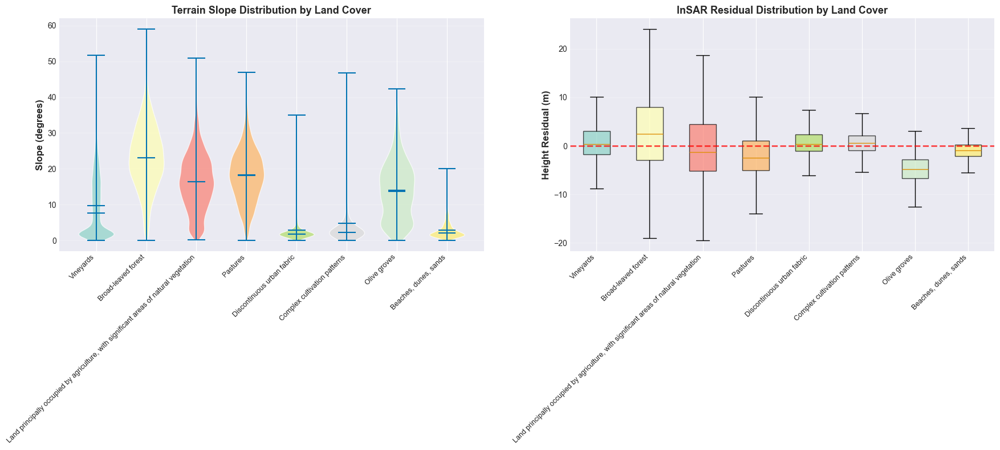
    


    [OK] Saved land_cover_vs_terrain.png
    

---
## 10. Advanced Visualizations

### Scatter Plots: SAOCOM vs Reference DEMs


```python
# Prepare data for scatter plots
valid_tin = saocom_cleaned[['HEIGHT_ABSOLUTE_TIN', 'tinitaly_height']].dropna()
valid_cop = saocom_cleaned[['HEIGHT_ABSOLUTE_COP', 'copernicus_height']].dropna()

# Calculate statistics
stats_tin_scatter = {
    'n_points': len(valid_tin),
    'mean_diff': (valid_tin['HEIGHT_ABSOLUTE_TIN'] - valid_tin['tinitaly_height']).mean(),
    'rmse': np.sqrt(((valid_tin['HEIGHT_ABSOLUTE_TIN'] - valid_tin['tinitaly_height'])**2).mean()),
    'correlation': np.corrcoef(valid_tin['HEIGHT_ABSOLUTE_TIN'], valid_tin['tinitaly_height'])[0, 1]
}

stats_cop_scatter = {
    'n_points': len(valid_cop),
    'mean_diff': (valid_cop['HEIGHT_ABSOLUTE_COP'] - valid_cop['copernicus_height']).mean(),
    'rmse': np.sqrt(((valid_cop['HEIGHT_ABSOLUTE_COP'] - valid_cop['copernicus_height'])**2).mean()),
    'correlation': np.corrcoef(valid_cop['HEIGHT_ABSOLUTE_COP'], valid_cop['copernicus_height'])[0, 1]
}

# Create scatter plots
fig, axes = plt.subplots(1, 2, figsize=(16, 7))

plot_scatter_comparison(
    axes[0],
    valid_tin['tinitaly_height'].values,
    valid_tin['HEIGHT_ABSOLUTE_TIN'].values,
    'TINItaly Height (m)',
    'SAOCOM Height (m)',
    'SAOCOM vs TINItaly',
    stats_tin_scatter
)

plot_scatter_comparison(
    axes[1],
    valid_cop['copernicus_height'].values,
    valid_cop['HEIGHT_ABSOLUTE_COP'].values,
    'Copernicus Height (m)',
    'SAOCOM Height (m)',
    'SAOCOM vs Copernicus',
    stats_cop_scatter
)

# Add grid to all axes
if isinstance(ax, np.ndarray):
    for a in ax.flat:
        a.grid(True, alpha=0.3, linestyle="--", color="gray")
else:
    ax.grid(True, alpha=0.3, linestyle="--", color="gray")

plt.tight_layout()
plt.savefig(IMAGES_DIR / 'scatter_comparisons.png', dpi=300, bbox_inches='tight')
plt.show()
```


    
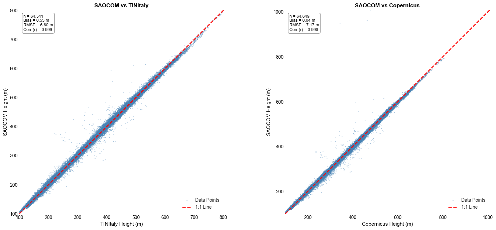
    


### Bland-Altman Plots


```python
# Bland-Altman analysis shows agreement between measurement methods
fig, axes = plt.subplots(1, 2, figsize=(16, 7))

plot_bland_altman(
    axes[0],
    valid_tin['tinitaly_height'].values,
    valid_tin['HEIGHT_ABSOLUTE_TIN'].values,
    'TINItaly',
    'SAOCOM',
    'Bland-Altman: SAOCOM vs TINItaly',
    fig=fig
)

plot_bland_altman(
    axes[1],
    valid_cop['copernicus_height'].values,
    valid_cop['HEIGHT_ABSOLUTE_COP'].values,
    'Copernicus',
    'SAOCOM',
    'Bland-Altman: SAOCOM vs Copernicus',
    fig=fig
)

# Add grid to all axes
if isinstance(ax, np.ndarray):
    for a in ax.flat:
        a.grid(True, alpha=0.3, linestyle="--", color="gray")
else:
    ax.grid(True, alpha=0.3, linestyle="--", color="gray")

plt.tight_layout()
plt.savefig(IMAGES_DIR / 'bland_altman.png', dpi=300, bbox_inches='tight')
plt.show()
```


    
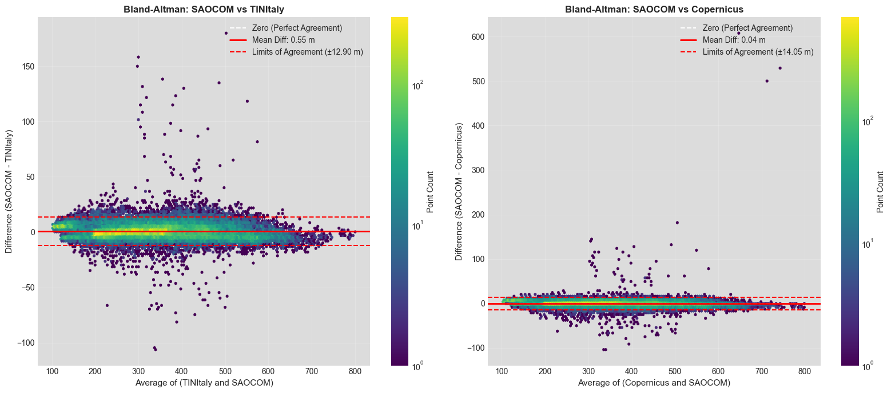
    


### Spatial Distribution of Residuals


```python
# Create spatial map of residuals
fig, axes = plt.subplots(1, 2, figsize=(18, 8))

# TINItaly residuals
valid_pts_tin = saocom_cleaned[saocom_cleaned['diff_tinitaly'].notna()]
vmin, vmax = np.percentile(valid_pts_tin['diff_tinitaly'], [2, 98])

sc1 = axes[0].scatter(
    valid_pts_tin.geometry.x,
    valid_pts_tin.geometry.y,
    c=valid_pts_tin['diff_tinitaly'],
    cmap='RdBu_r',
    s=3,
    vmin=vmin,
    vmax=vmax,
    alpha=0.7
)
plt.colorbar(sc1, ax=axes[0], label='Residual (m)')

# Add hull bounding box
hull = saocom_cleaned.geometry.unary_union.convex_hull
hull_gdf = gpd.GeoDataFrame(geometry=[hull], crs=saocom_cleaned.crs)
hull_gdf.boundary.plot(ax=axes[0], color='red', linewidth=2, linestyle='--', label='Study Area Hull')

axes[0].set_title('SAOCOM - TINItaly Residuals', fontsize=14, fontweight='bold')
axes[0].set_xlabel('Easting (m)')
axes[0].set_ylabel('Northing (m)')
axes[0].set_aspect('equal')
axes[0].grid(alpha=0.3)

# Add scale bar
from matplotlib_scalebar.scalebar import ScaleBar
scalebar1 = ScaleBar(1, 'm', length_fraction=0.25, location='lower right',
                     box_alpha=0.8, scale_loc='top', color='black',
                     box_color='white')
axes[0].add_artist(scalebar1)

# Add north arrow (simple style)
axes[0].annotate('', xy=(0.95, 0.95), xytext=(0.95, 0.85),
            xycoords='axes fraction', fontsize=20,
            arrowprops=dict(arrowstyle='->', lw=2.5, color='black'),
            annotation_clip=False)
axes[0].text(0.95, 0.82, 'N', transform=axes[0].transAxes,
         fontsize=14, fontweight='bold', ha='center', va='top',
         bbox=dict(boxstyle='round,pad=0.3', facecolor='white', edgecolor='black', linewidth=1.5))


# Copernicus residuals
valid_pts_cop = saocom_cleaned[saocom_cleaned['diff_copernicus'].notna()]
vmin2, vmax2 = np.percentile(valid_pts_cop['diff_copernicus'], [2, 98])

sc2 = axes[1].scatter(
    valid_pts_cop.geometry.x,
    valid_pts_cop.geometry.y,
    c=valid_pts_cop['diff_copernicus'],
    cmap='RdBu_r',
    s=3,
    vmin=vmin2,
    vmax=vmax2,
    alpha=0.7
)
plt.colorbar(sc2, ax=axes[1], label='Residual (m)')
axes[1].set_title('SAOCOM - Copernicus Residuals', fontsize=14, fontweight='bold')
axes[1].set_xlabel('Easting (m)')
axes[1].set_ylabel('Northing (m)')
axes[1].set_aspect('equal')
axes[1].grid(alpha=0.3)

# Add scale bar
scalebar2 = ScaleBar(1, 'm', length_fraction=0.25, location='lower right',
                     box_alpha=0.8, scale_loc='top', color='black',
                     box_color='white')
axes[1].add_artist(scalebar2)

# Add north arrow (simple style)
axes[1].annotate('', xy=(0.95, 0.95), xytext=(0.95, 0.85),
            xycoords='axes fraction', fontsize=20,
            arrowprops=dict(arrowstyle='->', lw=2.5, color='black'),
            annotation_clip=False)
axes[1].text(0.95, 0.82, 'N', transform=axes[1].transAxes,
         fontsize=14, fontweight='bold', ha='center', va='top',
         bbox=dict(boxstyle='round,pad=0.3', facecolor='white', edgecolor='black', linewidth=1.5))


plt.tight_layout()
plt.savefig(IMAGES_DIR / 'spatial_residuals.png', dpi=300, bbox_inches='tight')
plt.show()
```


    
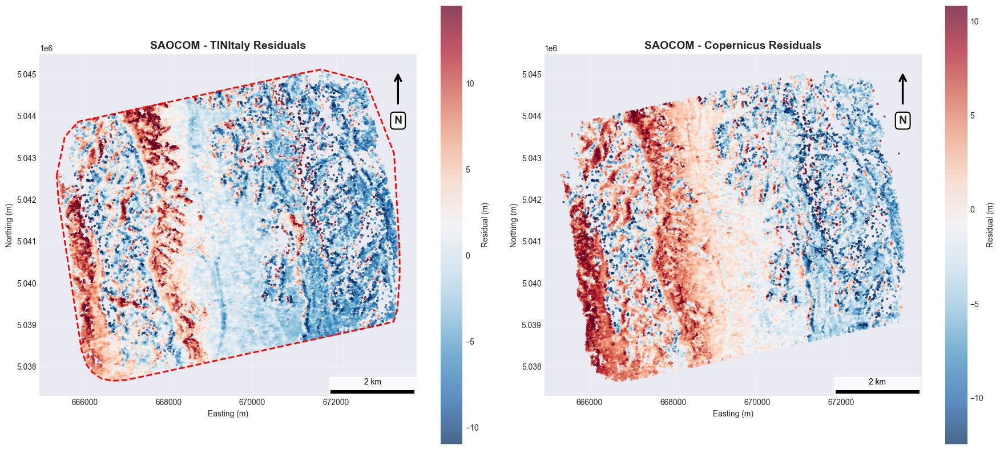
    


---
## 11. Export Results


```python
# Save cleaned dataset to shapefile
saocom_cleaned.to_file(SAOCOM_CLEANED_SHP)
print(f"Cleaned SAOCOM data saved to: {SAOCOM_CLEANED_SHP}")

# Export summary statistics to CSV
summary_stats = {
    'Reference_DEM': ['TINItaly', 'Copernicus'],
    'N_Points': [len(residuals_tin), len(residuals_cop)],
    'Mean_Residual_m': [residuals_tin.mean(), residuals_cop.mean()],
    'Std_Dev_m': [residuals_tin.std(), residuals_cop.std()],
    'RMSE_m': [np.sqrt((residuals_tin**2).mean()), np.sqrt((residuals_cop**2).mean())],
    'NMAD_m': [nmad_tin, nmad_cop],
    'Min_m': [residuals_tin.min(), residuals_cop.min()],
    'Max_m': [residuals_tin.max(), residuals_cop.max()]
}

summary_df = pd.DataFrame(summary_stats)
summary_df.to_csv(RESULTS_DIR / 'validation_summary.csv', index=False)
print(f"Summary statistics saved to: {RESULTS_DIR / 'validation_summary.csv'}")

print("\n" + summary_df.to_string(index=False))
```

    Cleaned SAOCOM data saved to: results\saocom_cleaned.shp
    Summary statistics saved to: results\validation_summary.csv
    
    Reference_DEM  N_Points  Mean_Residual_m  Std_Dev_m   RMSE_m   NMAD_m       Min_m      Max_m
         TINItaly     64541         0.551655   6.580134 6.603168 4.889227 -106.257848 179.795918
       Copernicus     64649         0.038537   7.166220 7.166268 4.636971 -103.762030 607.546832
    

---
## Summary & Conclusions

This notebook demonstrated a complete workflow for validating SAOCOM InSAR heights against reference DEMs:

### Key Findings:
1. **SAOCOM requires calibration**: InSAR heights are relative and need reference DEM calibration
2. **Accuracy varies by terrain**: Flat terrain shows better agreement than steep slopes
3. **Land cover matters**: Accuracy differs across vegetation types and surface characteristics
4. **Outlier detection improves results**: Machine learning helps identify anomalous measurements

### Best Practices:
- Always use high-coherence points (COHER >= 0.8) for calibration
- Apply spatial filtering to remove isolated points
- Use NMAD instead of RMSE for robust accuracy assessment
- Consider terrain and land cover when interpreting results

### Next Steps:
- Temporal analysis: Compare multiple acquisition dates
- Physical modeling: Incorporate atmospheric corrections
- Machine learning: Predict accuracy from terrain/land cover features
- Integration: Combine SAOCOM with other SAR sensors (Sentinel-1, etc.)

---
## 12. Additional Visualizations

Comprehensive visualization suite from the original analysis.


### 12.1 Spatial Coverage Map

Verify that SAOCOM points fall within the reference DEM extent.


```python
# Spatial overlap visualization
from matplotlib.patches import Rectangle

fig, ax = plt.subplots(figsize=(12, 10))

# TINITALY extent box
with rasterio.open(TINITALY_DEM) as src:
    dem_bounds = src.bounds
    # Reproject bounds to target CRS if needed
    import rasterio.warp
    dem_bounds_utm = rasterio.warp.transform_bounds(src.crs, TARGET_CRS, *dem_bounds)
    
    ax.add_patch(Rectangle(
        (dem_bounds_utm[0], dem_bounds_utm[1]),
        dem_bounds_utm[2] - dem_bounds_utm[0],
        dem_bounds_utm[3] - dem_bounds_utm[1],
        linewidth=3, edgecolor='blue', facecolor='none', label='TINItaly Extent'
    ))

# SAOCOM points
saocom_cleaned.plot(ax=ax, markersize=1, color='red', alpha=0.5, label='SAOCOM Points')

# Study area hull
from shapely.geometry import box
hull = saocom_cleaned.geometry.unary_union.convex_hull
hull_gdf = gpd.GeoDataFrame(geometry=[hull], crs=saocom_cleaned.crs)
hull_gdf.boundary.plot(ax=ax, color='green', linewidth=2, linestyle='--', label='Study Area Hull')

ax.set_xlabel('UTM Easting (m)', fontsize=12)
ax.set_ylabel('UTM Northing (m)', fontsize=12)
ax.set_title('Spatial Coverage: SAOCOM vs TINItaly DEM', fontsize=14, fontweight='bold')
ax.legend(loc='best', fontsize=10)
ax.grid(True, alpha=0.3)
ax.set_aspect('equal')

# Add scale bar
from matplotlib_scalebar.scalebar import ScaleBar
scalebar = ScaleBar(1, 'm', length_fraction=0.25, location='lower right',
                    box_alpha=0.7, scale_loc='top')
ax.add_artist(scalebar)

# Add north arrow (simple style)
ax.annotate('', xy=(0.95, 0.95), xytext=(0.95, 0.85),
            xycoords='axes fraction', fontsize=20,
            arrowprops=dict(arrowstyle='->', lw=2.5, color='black'),
            annotation_clip=False)
ax.text(0.95, 0.82, 'N', transform=ax.transAxes,
         fontsize=14, fontweight='bold', ha='center', va='top',
         bbox=dict(boxstyle='round,pad=0.3', facecolor='white', edgecolor='black', linewidth=1.5))


plt.tight_layout()
plt.savefig(IMAGES_DIR / 'spatial_coverage.png', dpi=300, bbox_inches='tight')
plt.show()

```


    
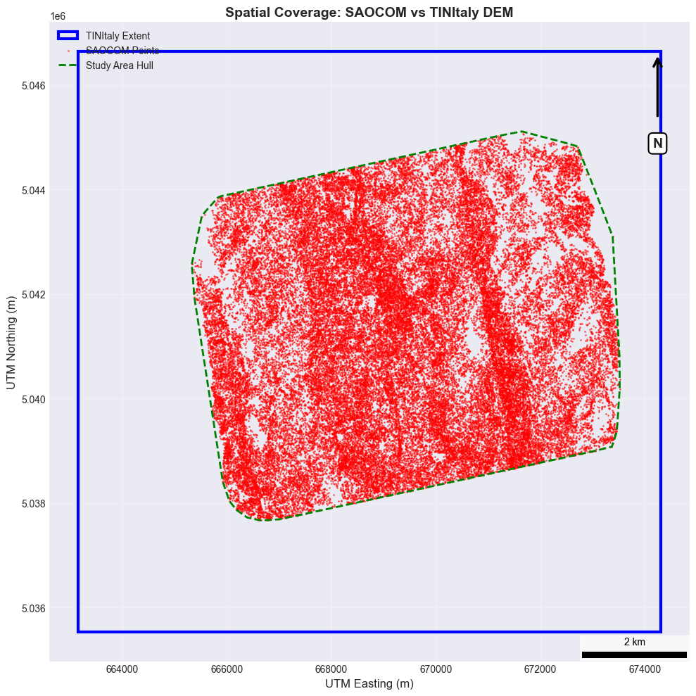
    


### 12.2 Gridded Comparison Analysis

Create gridded difference maps to show spatial patterns of height differences.


```python
# Create gridded difference maps (simplified)
print("Creating gridded difference maps...")

# Create simple gridded visualization using scatter plot rasterization
fig, axes = plt.subplots(1, 2, figsize=(18, 8))

# TINItaly grid - create from point residuals
valid_tin_pts = saocom_cleaned[saocom_cleaned['diff_tinitaly'].notna()]
if len(valid_tin_pts) > 0:
    vmin, vmax = np.percentile(valid_tin_pts['diff_tinitaly'], [2, 98])

    # Create gridded view using hexbin
    hb1 = axes[0].hexbin(
        valid_tin_pts.geometry.x,
        valid_tin_pts.geometry.y,
        C=valid_tin_pts['diff_tinitaly'],
        gridsize=100,
        cmap='RdBu_r',
        vmin=vmin,
        vmax=vmax,
        reduce_C_function=np.mean
    )
    plt.colorbar(hb1, ax=axes[0], label='Difference (m)')
    
# Add hull bounding box
hull = saocom_cleaned.geometry.unary_union.convex_hull
hull_gdf = gpd.GeoDataFrame(geometry=[hull], crs=saocom_cleaned.crs)
hull_gdf.boundary.plot(ax=axes[0], color='red', linewidth=2, linestyle='--', label='Study Area Hull')

axes[0].set_title('SAOCOM - TINItaly (Gridded)', fontsize=14, fontweight='bold')
axes[0].set_xlabel('Easting (m)')
axes[0].set_ylabel('Northing (m)')
axes[0].set_aspect('equal')
axes[0].grid(True, alpha=0.3)

# Add scale bar
from matplotlib_scalebar.scalebar import ScaleBar
scalebar1 = ScaleBar(1, 'm', length_fraction=0.25, location='lower right',
                     box_alpha=0.8, scale_loc='top', color='black',
                     box_color='white')
axes[0].add_artist(scalebar1)

# Add north arrow (simple style)
axes[0].annotate('', xy=(0.95, 0.95), xytext=(0.95, 0.85),
            xycoords='axes fraction', fontsize=20,
            arrowprops=dict(arrowstyle='->', lw=2.5, color='black'),
            annotation_clip=False)
axes[0].text(0.95, 0.82, 'N', transform=axes[0].transAxes,
         fontsize=14, fontweight='bold', ha='center', va='top',
         bbox=dict(boxstyle='round,pad=0.3', facecolor='white', edgecolor='black', linewidth=1.5))


# Copernicus grid
valid_cop_pts = saocom_cleaned[saocom_cleaned['diff_copernicus'].notna()]
if len(valid_cop_pts) > 0:
    vmin2, vmax2 = np.percentile(valid_cop_pts['diff_copernicus'], [2, 98])

    hb2 = axes[1].hexbin(
        valid_cop_pts.geometry.x,
        valid_cop_pts.geometry.y,
        C=valid_cop_pts['diff_copernicus'],
        gridsize=100,
        cmap='RdBu_r',
        vmin=vmin2,
        vmax=vmax2,
        reduce_C_function=np.mean
    )
    plt.colorbar(hb2, ax=axes[1], label='Difference (m)')
    axes[1].set_title('SAOCOM - Copernicus (Gridded)', fontsize=14, fontweight='bold')
    axes[1].set_xlabel('Easting (m)')
    axes[1].set_ylabel('Northing (m)')
    axes[1].set_aspect('equal')
axes[1].grid(True, alpha=0.3)

# Add scale bar
scalebar2 = ScaleBar(1, 'm', length_fraction=0.25, location='lower right',
                     box_alpha=0.8, scale_loc='top', color='black',
                     box_color='white')
axes[1].add_artist(scalebar2)

# Add north arrow (simple style)
axes[1].annotate('', xy=(0.95, 0.95), xytext=(0.95, 0.85),
            xycoords='axes fraction', fontsize=20,
            arrowprops=dict(arrowstyle='->', lw=2.5, color='black'),
            annotation_clip=False)
axes[1].text(0.95, 0.82, 'N', transform=axes[1].transAxes,
         fontsize=14, fontweight='bold', ha='center', va='top',
         bbox=dict(boxstyle='round,pad=0.3', facecolor='white', edgecolor='black', linewidth=1.5))


plt.tight_layout()
plt.savefig(IMAGES_DIR / 'gridded_comparison.png', dpi=300, bbox_inches='tight')
plt.show()

```

    Creating gridded difference maps...
    


    
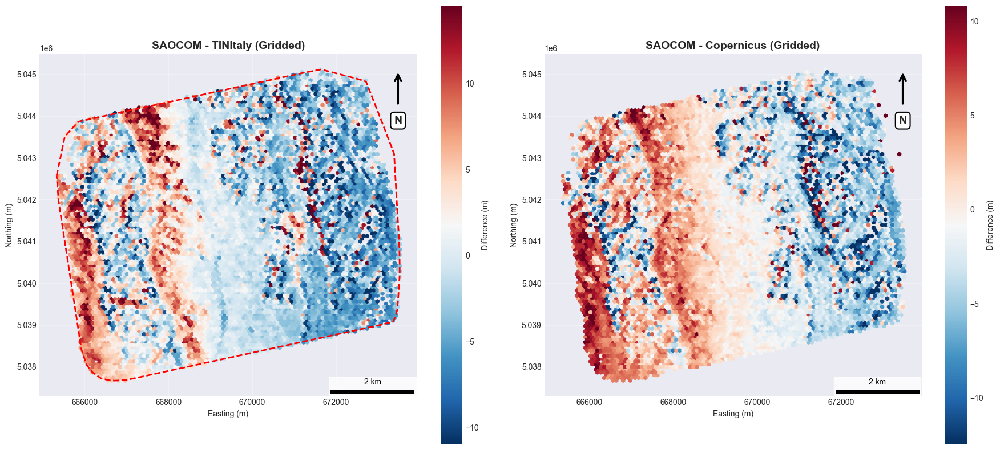
    


### 12.3 Density Plots (Hexbin)

Hexbin plots show the density of measurements, useful for identifying data clustering.


```python
# Hexbin density plots
fig, axes = plt.subplots(1, 2, figsize=(16, 7))

# TINItaly hexbin
valid_tin = saocom_cleaned[['HEIGHT_ABSOLUTE_TIN', 'tinitaly_height']].dropna()
hb1 = axes[0].hexbin(
    valid_tin['tinitaly_height'],
    valid_tin['HEIGHT_ABSOLUTE_TIN'],
    gridsize=50,
    cmap='YlOrRd',
    mincnt=1,
    edgecolors='none'
)
plt.colorbar(hb1, ax=axes[0], label='Count')

# 1:1 line
lims = [min(valid_tin['tinitaly_height'].min(), valid_tin['HEIGHT_ABSOLUTE_TIN'].min()),
        max(valid_tin['tinitaly_height'].max(), valid_tin['HEIGHT_ABSOLUTE_TIN'].max())]
axes[0].plot(lims, lims, 'k--', alpha=0.5, linewidth=2, label='1:1 Line')

axes[0].set_xlabel('TINItaly Height (m)', fontsize=12)
axes[0].set_ylabel('SAOCOM Height (m)', fontsize=12)
axes[0].set_title('Density: SAOCOM vs TINItaly', fontsize=14, fontweight='bold')
axes[0].legend()
axes[0].grid(alpha=0.3)

# Copernicus hexbin
valid_cop = saocom_cleaned[['HEIGHT_ABSOLUTE_COP', 'copernicus_height']].dropna()
hb2 = axes[1].hexbin(
    valid_cop['copernicus_height'],
    valid_cop['HEIGHT_ABSOLUTE_COP'],
    gridsize=50,
    cmap='YlOrRd',
    mincnt=1,
    edgecolors='none'
)
plt.colorbar(hb2, ax=axes[1], label='Count')

# 1:1 line
lims2 = [min(valid_cop['copernicus_height'].min(), valid_cop['HEIGHT_ABSOLUTE_COP'].min()),
         max(valid_cop['copernicus_height'].max(), valid_cop['HEIGHT_ABSOLUTE_COP'].max())]
axes[1].plot(lims2, lims2, 'k--', alpha=0.5, linewidth=2, label='1:1 Line')

axes[1].set_xlabel('Copernicus Height (m)', fontsize=12)
axes[1].set_ylabel('SAOCOM Height (m)', fontsize=12)
axes[1].set_title('Density: SAOCOM vs Copernicus', fontsize=14, fontweight='bold')
axes[1].legend()
axes[1].grid(alpha=0.3)

plt.tight_layout()
plt.savefig(IMAGES_DIR / 'hexbin_density.png', dpi=300, bbox_inches='tight')
plt.show()

```


    
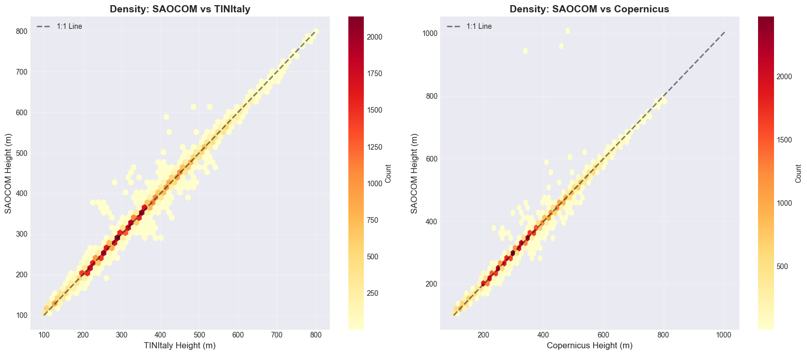
    


### 12.4 2D Histograms

Alternative visualization of measurement density.


```python
# 2D histogram plots
fig, axes = plt.subplots(1, 2, figsize=(16, 7))

# TINItaly 2D histogram
h1 = axes[0].hist2d(
    valid_tin['tinitaly_height'],
    valid_tin['HEIGHT_ABSOLUTE_TIN'],
    bins=100,
    cmap='viridis',
    cmin=1
)
plt.colorbar(h1[3], ax=axes[0], label='Count')

# 1:1 line
axes[0].plot(lims, lims, 'r--', alpha=0.7, linewidth=2, label='1:1 Line')
axes[0].set_xlabel('TINItaly Height (m)', fontsize=12)
axes[0].set_ylabel('SAOCOM Height (m)', fontsize=12)
axes[0].set_title('2D Histogram: SAOCOM vs TINItaly', fontsize=14, fontweight='bold')
axes[0].legend()
axes[0].grid(alpha=0.3)

# Copernicus 2D histogram
h2 = axes[1].hist2d(
    valid_cop['copernicus_height'],
    valid_cop['HEIGHT_ABSOLUTE_COP'],
    bins=100,
    cmap='viridis',
    cmin=1
)
plt.colorbar(h2[3], ax=axes[1], label='Count')

# 1:1 line
axes[1].plot(lims2, lims2, 'r--', alpha=0.7, linewidth=2, label='1:1 Line')
axes[1].set_xlabel('Copernicus Height (m)', fontsize=12)
axes[1].set_ylabel('SAOCOM Height (m)', fontsize=12)
axes[1].set_title('2D Histogram: SAOCOM vs Copernicus', fontsize=14, fontweight='bold')
axes[1].legend()
axes[1].grid(alpha=0.3)

plt.tight_layout()
plt.savefig(IMAGES_DIR / 'hist2d_comparison.png', dpi=300, bbox_inches='tight')
plt.show()

```


    
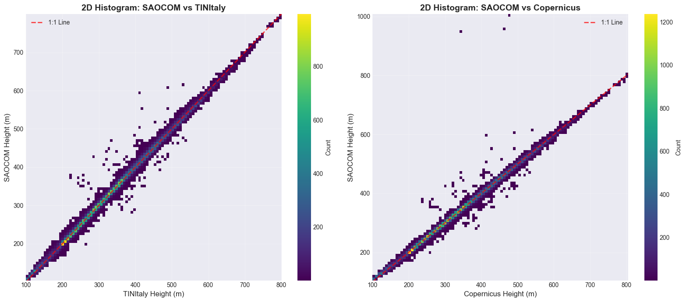
    


### 12.5 Violin Plots - Accuracy by Slope Category

Detailed performance breakdown showing full distribution of residuals for each terrain type.


```python
# Violin plot of residuals by slope category
fig, ax = plt.subplots(figsize=(12, 7))

# Prepare data for violin plot
slope_data = saocom_cleaned[['slope_category', 'diff_tinitaly']].dropna()

# Create violin plot
parts = ax.violinplot(
    [slope_data[slope_data['slope_category'] == cat]['diff_tinitaly'].values 
     for cat in slope_labels],
    positions=range(len(slope_labels)),
    showmeans=True,
    showmedians=True,
    widths=0.7
)

# Customize colors
for pc in parts['bodies']:
    pc.set_facecolor('steelblue')
    pc.set_alpha(0.7)

ax.set_xticks(range(len(slope_labels)))
ax.set_xticklabels(slope_labels, rotation=0)
ax.set_xlabel('Slope Category', fontsize=12, fontweight='bold')
ax.set_ylabel('Residual (SAOCOM - TINItaly) [m]', fontsize=12, fontweight='bold')
ax.set_title('Residual Distribution by Slope Category', fontsize=14, fontweight='bold')
ax.axhline(y=0, color='red', linestyle='--', alpha=0.5, linewidth=2, label='Zero Error')
ax.grid(True, alpha=0.3, axis='y')
ax.legend()

plt.tight_layout()
plt.savefig(IMAGES_DIR / 'violin_plot_slope.png', dpi=300, bbox_inches='tight')
plt.show()

print("\nStatistics by slope category:")
print(slope_stats)

```


    
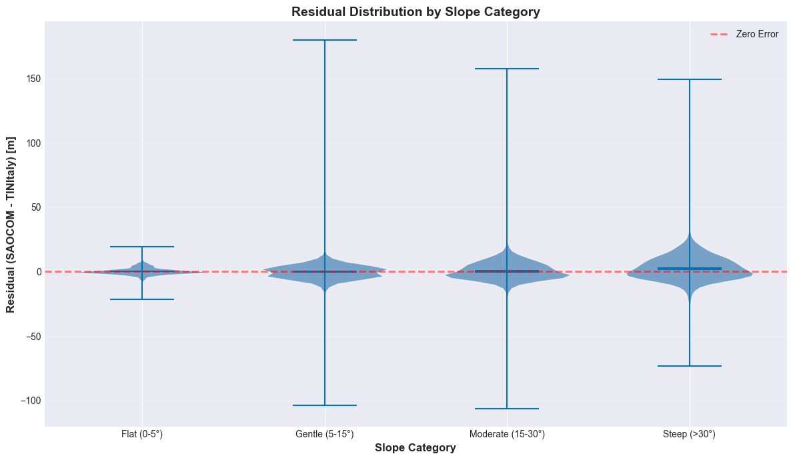
    


    
    Statistics by slope category:
                       count  mean    std  nmad
    slope_category                             
    Flat (0-5°)        19181  0.33   2.82  2.11
    Gentle (5-15°)     15544 -0.09   5.88  5.62
    Moderate (15-30°)  25231  0.71   7.72  6.91
    Steep (>30°)        4550  2.86  11.16  9.03
    

### 12.6 Residuals vs Coherence

Investigate the relationship between measurement quality (coherence) and accuracy.


```python
# Binned analysis of residuals vs coherence
print("Creating binned coherence analysis...")

from scipy import stats

fig, axes = plt.subplots(1, 2, figsize=(16, 7))

# TINItaly residuals vs coherence (binned)
valid_data_tin = saocom_cleaned[['COHER', 'diff_tinitaly']].dropna()

# Create bins of width 0.05
coherence_bins = np.arange(0, 1.05, 0.05)
bin_centers = (coherence_bins[:-1] + coherence_bins[1:]) / 2

# Bin the data
valid_data_tin['coher_bin'] = pd.cut(valid_data_tin['COHER'], bins=coherence_bins, labels=bin_centers)

# Calculate statistics per bin
bin_stats_tin = valid_data_tin.groupby('coher_bin', observed=True)['diff_tinitaly'].agg([
    ('mean', 'mean'),
    ('std', 'std'),
    ('count', 'count'),
    ('median', 'median')
]).reset_index()

# Filter bins with at least 10 points
bin_stats_tin = bin_stats_tin[bin_stats_tin['count'] >= 10]

# Plot
axes[0].errorbar(bin_stats_tin['coher_bin'], bin_stats_tin['mean'],
                 yerr=bin_stats_tin['std'], fmt='o-', capsize=5,
                 markersize=8, linewidth=2, color='steelblue', label='Mean ± Std')
axes[0].plot(bin_stats_tin['coher_bin'], bin_stats_tin['median'],
             's--', markersize=6, linewidth=1.5, color='coral', label='Median')
axes[0].axhline(y=0, color='black', linestyle='--', alpha=0.5, linewidth=2)

axes[0].set_xlabel('Coherence (binned, width=0.05)', fontsize=12, fontweight='bold')
axes[0].set_ylabel('Height Residual (m)', fontsize=12, fontweight='bold')
axes[0].set_title('SAOCOM - TINItaly: Residuals vs Coherence (Binned)',
                  fontsize=13, fontweight='bold')
axes[0].legend(loc='best', fontsize=10)
axes[0].grid(True, alpha=0.3, linestyle='--')

# Add sample size text
for idx, row in bin_stats_tin.iterrows():
    if idx % 3 == 0:  # Show every 3rd label to avoid crowding
        axes[0].text(row['coher_bin'], axes[0].get_ylim()[1] * 0.9,
                     f"n={int(row['count'])}", fontsize=8, ha='center', alpha=0.7)

# Copernicus residuals vs coherence (binned)
valid_data_cop = saocom_cleaned[['COHER', 'diff_copernicus']].dropna()
valid_data_cop['coher_bin'] = pd.cut(valid_data_cop['COHER'], bins=coherence_bins, labels=bin_centers)

bin_stats_cop = valid_data_cop.groupby('coher_bin', observed=True)['diff_copernicus'].agg([
    ('mean', 'mean'),
    ('std', 'std'),
    ('count', 'count'),
    ('median', 'median')
]).reset_index()

bin_stats_cop = bin_stats_cop[bin_stats_cop['count'] >= 10]

axes[1].errorbar(bin_stats_cop['coher_bin'], bin_stats_cop['mean'],
                 yerr=bin_stats_cop['std'], fmt='o-', capsize=5,
                 markersize=8, linewidth=2, color='steelblue', label='Mean ± Std')
axes[1].plot(bin_stats_cop['coher_bin'], bin_stats_cop['median'],
             's--', markersize=6, linewidth=1.5, color='coral', label='Median')
axes[1].axhline(y=0, color='black', linestyle='--', alpha=0.5, linewidth=2)

axes[1].set_xlabel('Coherence (binned, width=0.05)', fontsize=12, fontweight='bold')
axes[1].set_ylabel('Height Residual (m)', fontsize=12, fontweight='bold')
axes[1].set_title('SAOCOM - Copernicus: Residuals vs Coherence (Binned)',
                  fontsize=13, fontweight='bold')
axes[1].legend(loc='best', fontsize=10)
axes[1].grid(True, alpha=0.3, linestyle='--')

plt.tight_layout()
plt.savefig(IMAGES_DIR / 'residuals_vs_coherence.png', dpi=300, bbox_inches='tight')
plt.show()

print(f"[OK] Saved binned coherence analysis")

```

    Creating binned coherence analysis...
    


    
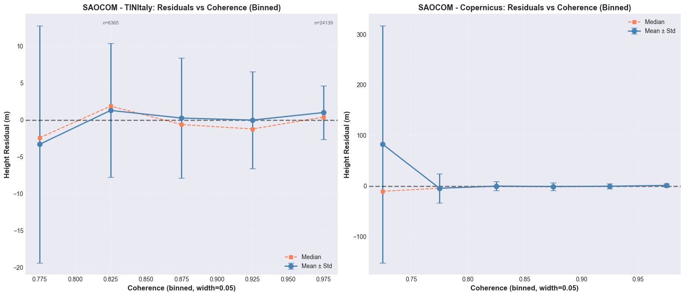
    


    [OK] Saved binned coherence analysis
    

### 12.7 Terrain Slope Map

Visualize the terrain slope across the study area.


```python
# Display slope raster
fig, ax = plt.subplots(figsize=(12, 10))

# Calculate extent from transform
extent = [
    target_transform.c,  # left (min x)
    target_transform.c + target_transform.a * grid_width,  # right (max x)
    target_transform.f + target_transform.e * grid_height,  # bottom (min y)
    target_transform.f  # top (max y)
]

# Plot slope
slope_plot = ax.imshow(slope_tin, cmap="terrain", vmin=0, vmax=45,
                       extent=extent, origin="upper")
cbar = plt.colorbar(slope_plot, ax=ax, label="Slope (degrees)")
cbar.ax.tick_params(labelsize=10)

ax.set_title("Terrain Slope from TINItaly DEM", fontsize=14, fontweight="bold")
# Add map elements
ax.set_xlabel("UTM Easting (m)", fontsize=10)
ax.set_ylabel("UTM Northing (m)", fontsize=10)
ax.set_aspect("equal", adjustable="box")
ax.grid(True, alpha=0.2, color="white")

# Add scale bar
from matplotlib_scalebar.scalebar import ScaleBar
scalebar = ScaleBar(10, "m", length_fraction=0.25, location="lower right",
                    box_alpha=0.7, scale_loc="top")
ax.add_artist(scalebar)

# Add north arrow (simple style)
ax.annotate('', xy=(0.95, 0.95), xytext=(0.95, 0.85),
            xycoords='axes fraction', fontsize=20,
            arrowprops=dict(arrowstyle='->', lw=2.5, color='black'),
            annotation_clip=False)
ax.text(0.95, 0.82, 'N', transform=ax.transAxes,
         fontsize=14, fontweight='bold', ha='center', va='top',
         bbox=dict(boxstyle='round,pad=0.3', facecolor='white', edgecolor='black', linewidth=1.5))

plt.tight_layout()
plt.savefig(IMAGES_DIR / "terrain_slope.png", dpi=300, bbox_inches="tight")
plt.show()

print(f"Slope statistics:")
print(f"  Mean: {np.nanmean(slope_tin):.1f}°")
print(f"  Median: {np.nanmedian(slope_tin):.1f}°")
print(f"  Max: {np.nanmax(slope_tin):.1f}°")
```


    
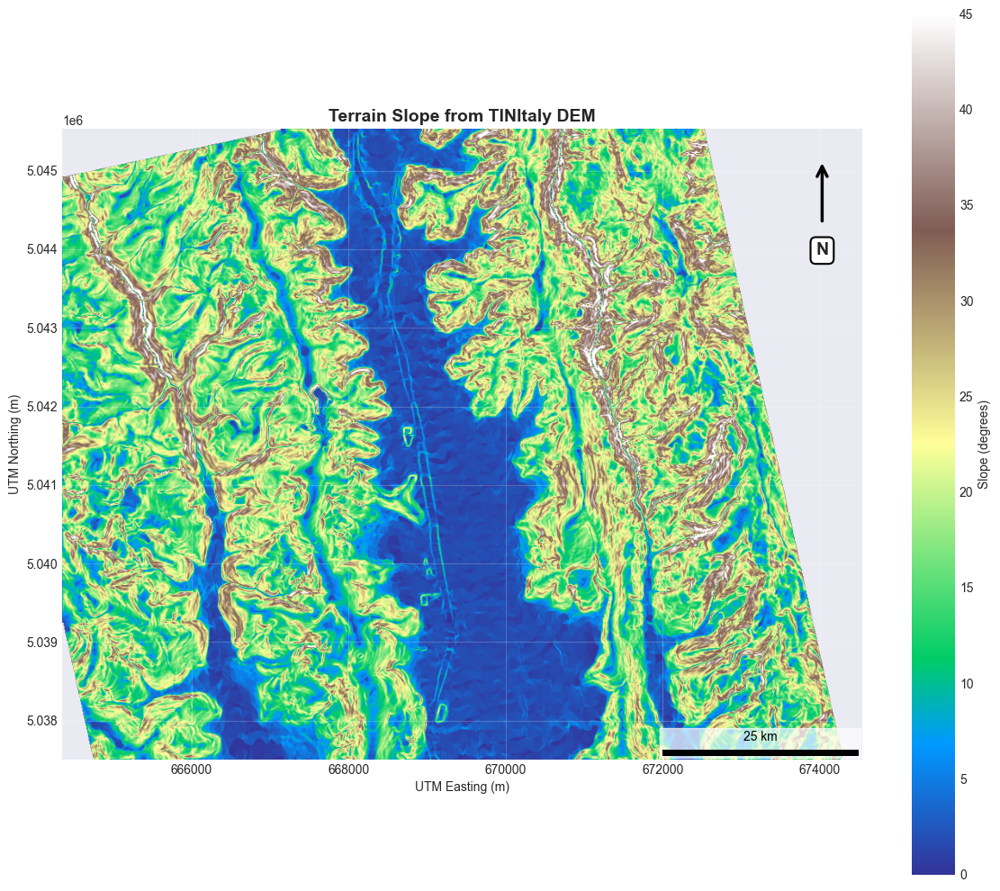
    


    Slope statistics:
      Mean: 16.1°
      Median: 15.9°
      Max: 59.3°
    

### 12.8 Reference DEM Comparison

Direct comparison of TINItaly and Copernicus DEMs.


```python
# Reference DEM comparison
print("Creating reference DEM comparison...")

# Calculate difference between reference DEMs
dem_diff = tinitaly_10m - copernicus_10m
dem_diff[tinitaly_10m == -9999] = np.nan
dem_diff[copernicus_10m == -9999] = np.nan

# Create multi-panel comparison
fig, axes = plt.subplots(2, 2, figsize=(18, 16))

# Calculate extent
extent = [
    target_transform.c,
    target_transform.c + target_transform.a * grid_width,
    target_transform.f + target_transform.e * grid_height,
    target_transform.f
]

# TINItaly DEM
tin_plot = tinitaly_10m.copy()
tin_plot[tin_plot == -9999] = np.nan
im1 = axes[0, 0].imshow(tin_plot, cmap="terrain", extent=extent, origin="upper")
plt.colorbar(im1, ax=axes[0, 0], label="Elevation (m)")
axes[0, 0].set_title("TINItaly DEM (10m)", fontsize=14, fontweight="bold")
axes[0, 0].set_xlabel("UTM Easting (m)", fontsize=8)
axes[0, 0].set_ylabel("UTM Northing (m)", fontsize=8)
axes[0, 0].set_aspect("equal", adjustable="box")
axes[0, 0].set_xticks([])
axes[0, 0].set_yticks([])

# Add scale bar
from matplotlib_scalebar.scalebar import ScaleBar
scalebar = ScaleBar(10, "m", length_fraction=0.25, location="lower right",
                    box_alpha=0.7, scale_loc="top", font_properties={"size": 8})
axes[0, 0].add_artist(scalebar)

# Add north arrow (simple style)
axes[0, 0].annotate('', xy=(0.95, 0.95), xytext=(0.95, 0.85),
            xycoords='axes fraction', fontsize=20,
            arrowprops=dict(arrowstyle='->', lw=2.5, color='black'),
            annotation_clip=False)
axes[0, 0].text(0.95, 0.82, 'N', transform=axes[0, 0].transAxes,
         fontsize=14, fontweight='bold', ha='center', va='top',
         bbox=dict(boxstyle='round,pad=0.3', facecolor='white', edgecolor='black', linewidth=1.5))


# Copernicus DEM
cop_plot = copernicus_10m.copy()
cop_plot[cop_plot == -9999] = np.nan
im2 = axes[0, 1].imshow(cop_plot, cmap="terrain", extent=extent, origin="upper")
plt.colorbar(im2, ax=axes[0, 1], label="Elevation (m)")
axes[0, 1].set_title("Copernicus DEM (10m)", fontsize=14, fontweight="bold")
axes[0, 1].set_aspect("equal", adjustable="box")
axes[0, 1].set_xticks([])
axes[0, 1].set_yticks([])
scalebar2 = ScaleBar(10, "m", length_fraction=0.25, location="lower right",
                     box_alpha=0.7, scale_loc="top", font_properties={"size": 8})
axes[0, 1].add_artist(scalebar2)

# Add north arrow (simple style)
axes[0, 1].annotate('', xy=(0.95, 0.95), xytext=(0.95, 0.85),
            xycoords='axes fraction', fontsize=20,
            arrowprops=dict(arrowstyle='->', lw=2.5, color='black'),
            annotation_clip=False)
axes[0, 1].text(0.95, 0.82, 'N', transform=axes[0, 1].transAxes,
         fontsize=14, fontweight='bold', ha='center', va='top',
         bbox=dict(boxstyle='round,pad=0.3', facecolor='white', edgecolor='black', linewidth=1.5))


# Difference map
if not np.all(np.isnan(dem_diff)):
    vmin, vmax = np.nanpercentile(dem_diff, [2, 98])
    im3 = axes[1, 0].imshow(dem_diff, extent=extent, origin="upper", cmap="RdBu_r", vmin=vmin, vmax=vmax)
    plt.colorbar(im3, ax=axes[1, 0], label="Difference (m)")
    axes[1, 0].set_title("TINItaly - Copernicus", fontsize=14, fontweight="bold")
    axes[1, 0].set_aspect("equal", adjustable="box")
    axes[1, 0].set_xticks([])
    axes[1, 0].set_yticks([])
    scalebar3 = ScaleBar(10, "m", length_fraction=0.25, location="lower right",
                         box_alpha=0.7, scale_loc="top", font_properties={"size": 8})
    axes[1, 0].add_artist(scalebar3)

# Add north arrow (simple style)
axes[1, 0].annotate('', xy=(0.95, 0.95), xytext=(0.95, 0.85),
            xycoords='axes fraction', fontsize=20,
            arrowprops=dict(arrowstyle='->', lw=2.5, color='black'),
            annotation_clip=False)
axes[1, 0].text(0.95, 0.82, 'N', transform=axes[1, 0].transAxes,
         fontsize=14, fontweight='bold', ha='center', va='top',
         bbox=dict(boxstyle='round,pad=0.3', facecolor='white', edgecolor='black', linewidth=1.5))


# Statistics panel
axes[1, 1].axis("off")
stats_text = f"""Reference DEM Comparison Statistics

TINItaly:
  Resolution: 10m (native)
  Range: [{np.nanmin(tin_plot):.1f}, {np.nanmax(tin_plot):.1f}] m
  Mean: {np.nanmean(tin_plot):.1f} m

Copernicus:
  Resolution: 30m → 10m (resampled)
  Range: [{np.nanmin(cop_plot):.1f}, {np.nanmax(cop_plot):.1f}] m
  Mean: {np.nanmean(cop_plot):.1f} m

Difference (TINItaly - Copernicus):
  Mean: {np.nanmean(dem_diff):.2f} m
  Std: {np.nanstd(dem_diff):.2f} m
  NMAD: {1.4826 * np.nanmedian(np.abs(dem_diff - np.nanmedian(dem_diff))):.2f} m
  Range: [{np.nanmin(dem_diff):.2f}, {np.nanmax(dem_diff):.2f}] m
"""

axes[1, 1].text(0.1, 0.5, stats_text, transform=axes[1, 1].transAxes,
                fontsize=12, verticalalignment="center", family="monospace",
                bbox=dict(boxstyle="round", facecolor="wheat", alpha=0.5))

# Add grid to all axes
for a in axes.flat:
    a.grid(True, alpha=0.3, linestyle="--", color="gray")

plt.tight_layout()
plt.savefig(IMAGES_DIR / "reference_dem_comparison.png", dpi=300, bbox_inches="tight")
plt.show()


```

    Creating reference DEM comparison...
    


    
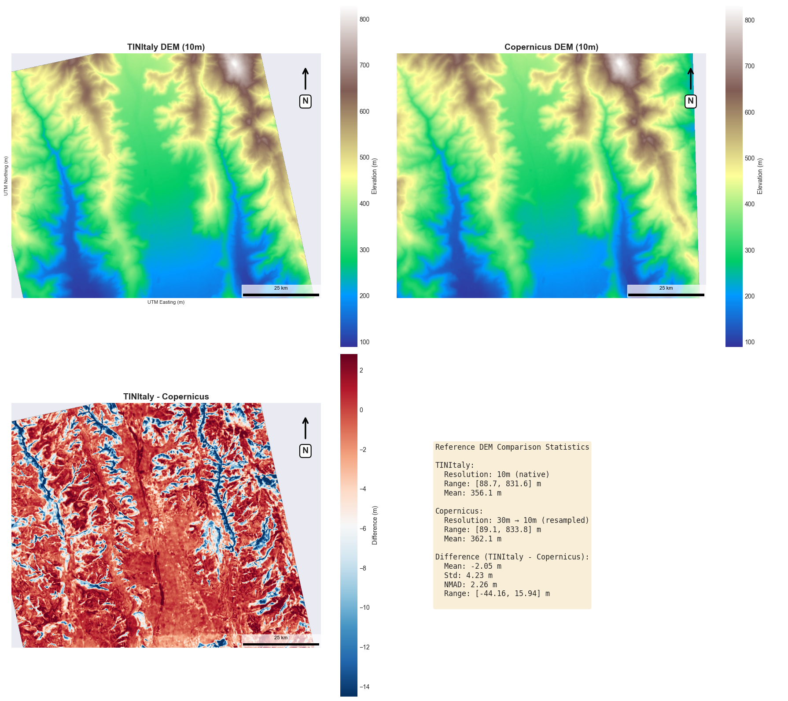
    


### 12.9 Coverage Grid and Void Zones

Analyze spatial coverage and identify void zones (areas without measurements).


```python
# Create SAOCOM coverage grid
print("Creating coverage grid...")

# Initialize coverage grid
coverage_grid = np.zeros((grid_height, grid_width), dtype=bool)

# Mark cells with SAOCOM data
for idx, row in saocom_cleaned.iterrows():
    r, c = rowcol(target_transform, row.geometry.x, row.geometry.y)
    r, c = int(r), int(c)
    if 0 <= r < grid_height and 0 <= c < grid_width:
        coverage_grid[r, c] = True

# Calculate void zones
total_cells = grid_height * grid_width
covered_cells = coverage_grid.sum()
void_cells = total_cells - covered_cells
coverage_pct = 100 * covered_cells / total_cells

print(f"Coverage statistics:")
print(f"  Total grid cells: {total_cells:,}")
print(f"  Covered cells: {covered_cells:,}")
print(f"  Void cells: {void_cells:,}")
print(f"  Coverage: {coverage_pct:.1f}%")

# Visualize coverage
fig, axes = plt.subplots(1, 2, figsize=(18, 8))

# Calculate extent for raster displays
extent = [
    target_transform.c,
    target_transform.c + target_transform.a * grid_width,
    target_transform.f + target_transform.e * grid_height,
    target_transform.f
]

# Coverage map
axes[0].imshow(coverage_grid, cmap="binary", interpolation="nearest", extent=extent, origin="upper")

# Add hull bounding box
hull = saocom_cleaned.geometry.unary_union.convex_hull
hull_gdf = gpd.GeoDataFrame(geometry=[hull], crs=saocom_cleaned.crs)
hull_gdf.boundary.plot(ax=axes[0], color="red", linewidth=2, linestyle="--", label="Study Area Hull")

axes[0].set_title(f"SAOCOM Coverage Grid ({coverage_pct:.1f}% covered)", fontsize=14, fontweight="bold")
axes[0].set_xlabel("UTM Easting (m)", fontsize=10)
axes[0].set_ylabel("UTM Northing (m)", fontsize=10)
axes[0].set_aspect("equal", adjustable="box")

# Void zones overlay on slope
void_mask = ~coverage_grid
slope_with_voids = slope_tin.copy()
slope_with_voids[void_mask] = np.nan

im2 = axes[1].imshow(slope_tin, cmap="terrain", alpha=0.7, extent=extent, origin="upper")
axes[1].imshow(void_mask, cmap="Reds", alpha=0.3, extent=extent, origin="upper")
plt.colorbar(im2, ax=axes[1], label="Slope (degrees)")
axes[1].set_title("Void Zones (red) over Terrain Slope", fontsize=14, fontweight="bold")
axes[1].set_xlabel("UTM Easting (m)", fontsize=10)
axes[1].set_ylabel("UTM Northing (m)", fontsize=10)
axes[1].set_aspect("equal", adjustable="box")

# Add scale bar to first axis
from matplotlib_scalebar.scalebar import ScaleBar
scalebar = ScaleBar(10, "m", length_fraction=0.25, location="lower right",
                    box_alpha=0.7, scale_loc="top", font_properties={"size": 8})
axes[0].add_artist(scalebar)

# Add north arrow (simple style)
None.annotate('', xy=(0.95, 0.95), xytext=(0.95, 0.85),
            xycoords='axes fraction', fontsize=20,
            arrowprops=dict(arrowstyle='->', lw=2.5, color='black'),
            annotation_clip=False)
None.text(0.95, 0.82, 'N', transform=None.transAxes,
         fontsize=14, fontweight='bold', ha='center', va='top',
         bbox=dict(boxstyle='round,pad=0.3', facecolor='white', edgecolor='black', linewidth=1.5))


# Add grid to all axes
for a in axes.flat:
    a.grid(True, alpha=0.3, linestyle="--", color="gray")

plt.tight_layout()
plt.savefig(IMAGES_DIR / "coverage_and_voids.png", dpi=300, bbox_inches="tight")
plt.show()
```

    Creating coverage grid...
    Coverage statistics:
      Total grid cells: 816,436
      Covered cells: 62,326
      Void cells: 754,110
      Coverage: 7.6%
    


    ---------------------------------------------------------------------------

    AttributeError                            Traceback (most recent call last)

    Cell In[48], line 70
         67 axes[0].add_artist(scalebar)
         69 # Add north arrow (simple style)
    ---> 70 None.annotate('', xy=(0.95, 0.95), xytext=(0.95, 0.85),
         71             xycoords='axes fraction', fontsize=20,
         72             arrowprops=dict(arrowstyle='->', lw=2.5, color='black'),
         73             annotation_clip=False)
         74 None.text(0.95, 0.82, 'N', transform=None.transAxes,
         75          fontsize=14, fontweight='bold', ha='center', va='top',
         76          bbox=dict(boxstyle='round,pad=0.3', facecolor='white', edgecolor='black', linewidth=1.5))
         79 # Add grid to all axes
    

    AttributeError: 'NoneType' object has no attribute 'annotate'


    
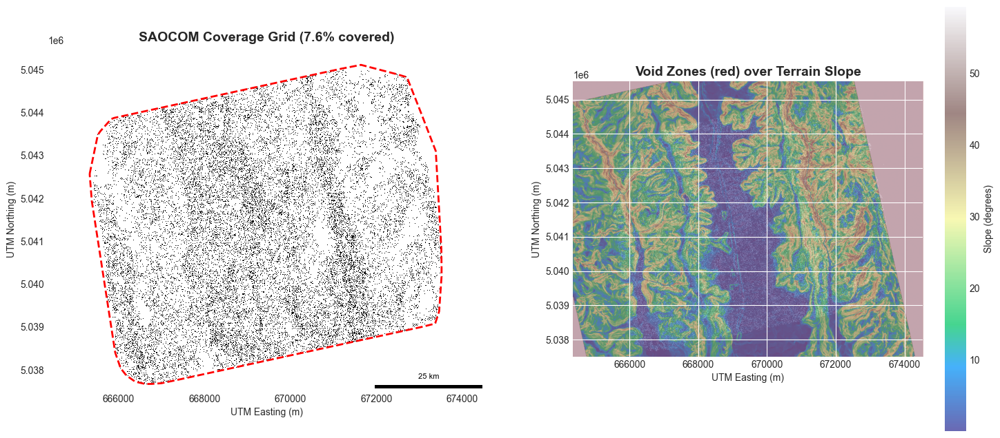
    


### 12.10 Residuals by Elevation Bins

Investigate if accuracy varies with elevation.


```python
# Bin residuals by elevation
height_bins = [0, 200, 400, 600, 800, 1000]
height_labels = ['0-200m', '200-400m', '400-600m', '600-800m', '800-1000m']

saocom_cleaned['height_category'] = pd.cut(
    saocom_cleaned['tinitaly_height'],
    bins=height_bins,
    labels=height_labels
)

# Calculate statistics by height
height_stats = saocom_cleaned.groupby('height_category')['diff_tinitaly'].agg([
    ('count', 'count'),
    ('mean', 'mean'),
    ('std', 'std'),
    ('nmad', lambda x: nmad(x.dropna()))
]).round(2)

print("\nAccuracy by elevation:")
print(height_stats)

# Visualize
fig, axes = plt.subplots(1, 2, figsize=(16, 6))

# Bar plot of NMAD by elevation
height_stats['nmad'].plot(kind='bar', ax=axes[0], color='coral', edgecolor='black')
axes[0].set_title('NMAD by Elevation Range', fontsize=14, fontweight='bold')
axes[0].set_xlabel('Elevation Range', fontsize=12)
axes[0].set_ylabel('NMAD (m)', fontsize=12)
axes[0].grid(axis='y', alpha=0.3)
axes[0].set_xticklabels(axes[0].get_xticklabels(), rotation=45, ha='right')

# Sample counts by elevation
height_stats['count'].plot(kind='bar', ax=axes[1], color='skyblue', edgecolor='black')
axes[1].set_title('Sample Count by Elevation Range', fontsize=14, fontweight='bold')
axes[1].set_xlabel('Elevation Range', fontsize=12)
axes[1].set_ylabel('Count', fontsize=12)
axes[1].grid(axis='y', alpha=0.3)
axes[1].set_xticklabels(axes[1].get_xticklabels(), rotation=45, ha='right')

plt.tight_layout()
plt.savefig(IMAGES_DIR / 'accuracy_by_elevation.png', dpi=300, bbox_inches='tight')
plt.show()

```

### 12.11 Summary Dashboard

Comprehensive summary of all validation metrics in one figure.


```python
# Create summary dashboard
fig = plt.figure(figsize=(20, 12))
gs = fig.add_gridspec(4, 2, hspace=0.3, wspace=0.3)

# 1. Spatial distribution
ax1 = fig.add_subplot(gs[0, 0])
saocom_cleaned.plot(ax=ax1, markersize=0.5, color='blue', alpha=0.3)

# Add hull bounding box
hull = saocom_cleaned.geometry.unary_union.convex_hull
hull_gdf = gpd.GeoDataFrame(geometry=[hull], crs=saocom_cleaned.crs)
hull_gdf.boundary.plot(ax=ax1, color='red', linewidth=2, linestyle='--', label='Study Area Hull')

ax1.set_title('SAOCOM Point Distribution', fontweight='bold')
ax1.set_xlabel('Easting (m)')
ax1.set_ylabel('Northing (m)')
ax1.set_aspect('equal')
ax1.grid(True, alpha=0.3)

# Add scale bar
from matplotlib_scalebar.scalebar import ScaleBar
scalebar = ScaleBar(1, 'm', length_fraction=0.25, location='lower right',
                    box_alpha=0.8, scale_loc='top', color='black',
                    box_color='white')
ax1.add_artist(scalebar)

# Add north arrow (simple style)
ax1.annotate('', xy=(0.95, 0.95), xytext=(0.95, 0.85),
            xycoords='axes fraction', fontsize=20,
            arrowprops=dict(arrowstyle='->', lw=2.5, color='black'),
            annotation_clip=False)
ax1.text(0.95, 0.82, 'N', transform=ax1.transAxes,
         fontsize=14, fontweight='bold', ha='center', va='top',
         bbox=dict(boxstyle='round,pad=0.3', facecolor='white', edgecolor='black', linewidth=1.5))


# 2. Residual histogram (TINItaly)
ax2 = fig.add_subplot(gs[0, 1])
ax2.hist(residuals_tin, bins=100, color='steelblue', edgecolor='black', alpha=0.7)
ax2.axvline(x=0, color='red', linestyle='--', linewidth=2)
ax2.set_title(f'Residuals (NMAD={nmad_tin:.2f}m)', fontweight='bold')
ax2.set_xlabel('SAOCOM - TINItaly (m)')
ax2.set_ylabel('Frequency')
ax2.grid(alpha=0.3)

# 3. Accuracy by slope
ax3 = fig.add_subplot(gs[1, 0])
slope_stats['nmad'].plot(kind='bar', ax=ax3, color='coral', edgecolor='black')
ax3.set_title('NMAD by Slope Category', fontweight='bold')
ax3.set_ylabel('NMAD (m)')
ax3.set_xticklabels(ax3.get_xticklabels(), rotation=45, ha='right')
ax3.grid(axis='y', alpha=0.3)

# 4. Scatter plot
ax4 = fig.add_subplot(gs[1, 1])
sample_size = min(10000, len(valid_tin))
sample_indices = np.random.choice(len(valid_tin), sample_size, replace=False)
ax4.scatter(
    valid_tin['tinitaly_height'].iloc[sample_indices],
    valid_tin['HEIGHT_ABSOLUTE_TIN'].iloc[sample_indices],
    s=1, alpha=0.3, color='blue'
)
lims = [valid_tin['tinitaly_height'].min(), valid_tin['tinitaly_height'].max()]
ax4.plot(lims, lims, 'r--', alpha=0.5, linewidth=2)
ax4.set_title('SAOCOM vs TINItaly', fontweight='bold')
ax4.set_xlabel('TINItaly Height (m)')
ax4.set_ylabel('SAOCOM Height (m)')
ax4.grid(alpha=0.3)

# 5. Slope map
ax5 = fig.add_subplot(gs[2, 0])
# Calculate extent for slope raster
extent = [
    target_transform.c,
    target_transform.c + target_transform.a * grid_width,
    target_transform.f + target_transform.e * grid_height,
    target_transform.f
]

slope_plot = ax5.imshow(slope_tin, cmap='terrain', vmin=0, vmax=45, extent=extent, origin='upper')
plt.colorbar(slope_plot, ax=ax5, label='Slope (°)', fraction=0.046)
ax5.set_title('Terrain Slope', fontweight='bold')
ax5.axis('off')

# 6. Residuals spatial map
ax6 = fig.add_subplot(gs[2, 1])
valid_pts = saocom_cleaned[saocom_cleaned['diff_tinitaly'].notna()]
sample_pts = valid_pts.sample(min(10000, len(valid_pts)))
vmin, vmax = np.percentile(sample_pts['diff_tinitaly'], [2, 98])
sc = ax6.scatter(
    sample_pts.geometry.x,
    sample_pts.geometry.y,
    c=sample_pts['diff_tinitaly'],
    cmap='RdBu_r',
    s=1,
    vmin=vmin,
    vmax=vmax,
    alpha=0.5
)
plt.colorbar(sc, ax=ax6, label='Residual (m)', fraction=0.046)
ax6.set_title('Spatial Residuals', fontweight='bold')
ax6.set_aspect('equal')
ax6.axis('off')

# 7. Statistics text
ax7 = fig.add_subplot(gs[3, :])
ax7.axis('off')

summary_text = f"""\nSAOCOM INSAR VALIDATION SUMMARY
{"="*80}

Dataset Statistics:
  Total points: {len(saocom_gdf):,}
  Outliers removed: {len(outliers):,} ({100*len(outliers)/len(saocom_gdf):.1f}%)
  Clean dataset: {len(saocom_cleaned):,}

Validation against TINItaly (10m resolution):
  NMAD: {nmad_tin:.2f} m
  RMSE: {np.sqrt((residuals_tin**2).mean()):.2f} m
  Mean error: {residuals_tin.mean():.2f} m
  Correlation: {np.corrcoef(valid_tin["HEIGHT_ABSOLUTE_TIN"], valid_tin["tinitaly_height"])[0,1]:.4f}

Validation against Copernicus (30m resampled to 10m):
  NMAD: {nmad_cop:.2f} m
  RMSE: {np.sqrt((residuals_cop**2).mean()):.2f} m
  Mean error: {residuals_cop.mean():.2f} m
  Correlation: {np.corrcoef(valid_cop["HEIGHT_ABSOLUTE_COP"], valid_cop["copernicus_height"])[0,1]:.4f}

Performance by Terrain:
  Flat (0-5°):        NMAD = {slope_stats.loc["Flat (0-5°)", "nmad"]:.2f} m  (n={int(slope_stats.loc["Flat (0-5°)", "count"]):,})
  Gentle (5-15°):     NMAD = {slope_stats.loc["Gentle (5-15°)", "nmad"]:.2f} m  (n={int(slope_stats.loc["Gentle (5-15°)", "count"]):,})
  Moderate (15-30°):  NMAD = {slope_stats.loc["Moderate (15-30°)", "nmad"]:.2f} m  (n={int(slope_stats.loc["Moderate (15-30°)", "count"]):,})
  Steep (>30°):       NMAD = {slope_stats.loc["Steep (>30°)", "nmad"]:.2f} m  (n={int(slope_stats.loc["Steep (>30°)", "count"]):,})
"""

ax7.text(0.05, 0.5, summary_text, transform=ax7.transAxes,
         fontsize=11, verticalalignment='center', family='monospace',
         bbox=dict(boxstyle='round', facecolor='lightblue', alpha=0.3))

fig.suptitle('SAOCOM InSAR Height Validation - Complete Summary',
             fontsize=16, fontweight='bold', y=0.98)

plt.savefig(IMAGES_DIR / 'summary_dashboard.png', dpi=300, bbox_inches='tight')
plt.show()

```

## 13. Principal Component Analysis of Void Zone Factors

Perform PCA to understand which factors (coherence, slope, land cover, geometric quality, etc.) contribute most to void zones and poor data quality areas.


```python
# Principal Component Analysis of Void Zone Factors
from sklearn.decomposition import PCA
from sklearn.preprocessing import StandardScaler, LabelEncoder
from sklearn.impute import SimpleImputer
import seaborn as sns
import matplotlib.pyplot as plt
import pandas as pd
import numpy as np

print("="*80)
print("PCA ANALYSIS OF VOID ZONE CONTRIBUTING FACTORS")
print("="*80)

# Step 1: Define void zones based on multiple quality criteria
print("\n[1/7] Defining void zones")

# Create a composite quality score (lower is worse)
df_pca = saocom_cleaned.copy()


# Define void zones as areas with one or more quality issues:
df_pca["is_void_zone"] = (
    (df_pca["COHER"] < 0.5) |  # Low coherence
    (df_pca.get("is_shadow", 0) == 1) |  # Shadow areas
    (np.abs(df_pca["diff_tinitaly"]) > df_pca["diff_tinitaly"].quantile(0.90)) |  # High residuals (top 10%)
    (df_pca["outlier_score"] > df_pca["outlier_score"].quantile(0.90))  # Outlier areas
).astype(int)

void_count = df_pca["is_void_zone"].sum()
void_pct = 100 * void_count / len(df_pca)
print(f"  Void zones identified: {void_count:,} / {len(df_pca):,} ({void_pct:.1f}%)")

# Step 2: Select features for PCA
print("\n[2/7] Selecting features for PCA...")

feature_columns = [
    "COHER",                    # Temporal coherence
    "slope_tin",                # Terrain slope
    "aspect_tin",               # Terrain aspect
    "tinitaly_height",          # Elevation
    "outlier_score",            # Outlier detection score
    "diff_tinitaly",            # Residual vs reference
    "SIGMA HEIGHT",             # Height uncertainty
]

# Add optional columns if they exist
if "local_incidence" in df_pca.columns:
    feature_columns.append("local_incidence")
if "geometric_quality" in df_pca.columns:
    feature_columns.append("geometric_quality")

# Handle land cover - use one-hot encoding for better interpretability
land_cover_features = []
if "land_cover_level1" in df_pca.columns:
    print("  Processing land cover categories...")
    # Get top land cover categories (those with >1% of points)
    lc_counts = df_pca["land_cover_level1"].value_counts()
    lc_threshold = len(df_pca) * 0.01
    major_lc_types = lc_counts[lc_counts > lc_threshold].index.tolist()
    
    # Create binary indicators for major land cover types
    for lc_type in major_lc_types:
        # Clean the land cover type name for column naming
        clean_name = lc_type.replace(" ", "_").replace(",", "").replace("&", "and")[:20]
        col_name = f"lc_{clean_name}"
        df_pca[col_name] = (df_pca["land_cover_level1"] == lc_type).astype(int)
        land_cover_features.append(col_name)
    
    print(f"  Created {len(land_cover_features)} land cover binary features from major types")
    print(f"    Major types: {major_lc_types}")
    
    # Add to feature list
    feature_columns.extend(land_cover_features)
else:
    print("  WARNING: land_cover_level1 column not found - skipping land cover features")

print(f"\n  Total features selected: {len(feature_columns)}")
print("  Feature list:")
for i, col in enumerate(feature_columns, 1):
    print(f"    {i:2d}. {col}")

# Step 3: Prepare feature matrix
print("\n[3/7] Preparing feature matrix...")

# Extract features
X = df_pca[feature_columns].copy()

# Handle missing values with median imputation
imputer = SimpleImputer(strategy="median")
X_imputed = imputer.fit_transform(X)
X_imputed_df = pd.DataFrame(X_imputed, columns=feature_columns, index=df_pca.index)

missing_before = X.isnull().sum().sum()
print(f"  Missing values imputed: {missing_before:,}")
print(f"  Feature matrix shape: {X_imputed.shape}")

# Step 4: Standardize features
print("\n[4/7] Standardizing features...")

scaler = StandardScaler()
X_scaled = scaler.fit_transform(X_imputed)

print(f"  Features standardized to mean=0, std=1")

# Step 5: Perform PCA
print("\n[5/7] Performing PCA...")

n_components = min(len(feature_columns), 10)  # Use up to 10 components
pca = PCA(n_components=n_components, random_state=42)
X_pca = pca.fit_transform(X_scaled)

print(f"  PCA components computed: {n_components}")
print(f"  Explained variance ratio:")
for i, var in enumerate(pca.explained_variance_ratio_, 1):
    cum_var = pca.explained_variance_ratio_[:i].sum()
    print(f"    PC{i}: {var*100:5.2f}% (cumulative: {cum_var*100:5.2f}%)")

# Step 6: Analyze component loadings
print("\n[6/7] Analyzing component loadings...")

loadings = pd.DataFrame(
    pca.components_.T,
    columns=[f"PC{i+1}" for i in range(n_components)],
    index=feature_columns
)

print("\n  Top feature loadings for PC1:")
pc1_loadings = loadings["PC1"].abs().sort_values(ascending=False)
for feat, loading in pc1_loadings.head(8).items():
    print(f"    {feat:30s}: {loadings.loc[feat, 'PC1']:+.3f}")

print("\n  Top feature loadings for PC2:")
pc2_loadings = loadings["PC2"].abs().sort_values(ascending=False)
for feat, loading in pc2_loadings.head(8).items():
    print(f"    {feat:30s}: {loadings.loc[feat, 'PC2']:+.3f}")

# Check land cover contribution
if land_cover_features:
    print("\n  Land cover feature loadings on PC1:")
    for lc_feat in land_cover_features:
        if lc_feat in loadings.index:
            print(f"    {lc_feat:30s}: {loadings.loc[lc_feat, 'PC1']:+.3f}")

# Add PCA scores to dataframe
for i in range(min(3, n_components)):
    df_pca[f"PC{i+1}"] = X_pca[:, i]

# Step 7: Statistical comparison
print("\n[7/7] Comparing void vs non-void zones in PC space...")

for i in range(min(3, n_components)):
    pc_col = f"PC{i+1}"
    void_mean = df_pca[df_pca["is_void_zone"] == 1][pc_col].mean()
    non_void_mean = df_pca[df_pca["is_void_zone"] == 0][pc_col].mean()
    diff = abs(void_mean - non_void_mean)
    print(f"  {pc_col}: Void={void_mean:+.3f}, Non-void={non_void_mean:+.3f}, |Diff|={diff:.3f}")

print("\n" + "="*80)
print("PCA ANALYSIS COMPLETE")
print(f"Total features analyzed: {len(feature_columns)} (including {len(land_cover_features)} land cover types)")
print("="*80)

```


```python
# Visualize PCA Results
print("Creating PCA visualizations...\n")

# Create figure with 5 rows x 2 columns (2 plots per row max)
fig = plt.figure(figsize=(16, 20))
gs = fig.add_gridspec(5, 2, hspace=0.5, wspace=0.3)

# 1. Scree plot - Explained variance
ax1 = fig.add_subplot(gs[0, 0])
var_exp = pca.explained_variance_ratio_ * 100
cum_var = np.cumsum(var_exp)
x_pos = np.arange(1, len(var_exp) + 1)

ax1.bar(x_pos, var_exp, alpha=0.7, color="steelblue", label="Individual")
ax1.plot(x_pos, cum_var, color="red", marker="o", linewidth=2, label="Cumulative")
ax1.axhline(y=80, color="gray", linestyle="--", alpha=0.5, label="80% threshold")
ax1.set_xlabel("Principal Component", fontsize=11, fontweight="bold")
ax1.set_ylabel("Explained Variance (%)", fontsize=11, fontweight="bold")
ax1.set_title("Scree Plot - Variance Explained by PCs", fontsize=12, fontweight="bold")
ax1.legend()
ax1.grid(True, alpha=0.3)
ax1.set_xticks(x_pos)

# 2. Feature contribution to PC1 (bar plot)
ax2 = fig.add_subplot(gs[0, 1])
pc1_contrib = loadings["PC1"].abs().sort_values(ascending=True)
colors = ["red" if x < 0 else "blue" for x in loadings.loc[pc1_contrib.index, "PC1"]]
ax2.barh(range(len(pc1_contrib)), loadings.loc[pc1_contrib.index, "PC1"], color=colors, alpha=0.7)
ax2.set_yticks(range(len(pc1_contrib)))
ax2.set_yticklabels(pc1_contrib.index, fontsize=9)
ax2.set_xlabel("Loading on PC1", fontsize=11, fontweight="bold")
ax2.set_title("Feature Contributions to PC1", fontsize=12, fontweight="bold")
ax2.axvline(x=0, color="black", linestyle="-", linewidth=0.8)
ax2.grid(True, alpha=0.3, axis="x")

# 3. Component loadings heatmap (spans 2 columns)
ax3 = fig.add_subplot(gs[1, :])
sns.heatmap(loadings.T, annot=True, fmt=".2f", cmap="RdBu_r", center=0,
            cbar_kws={"label": "Loading"}, ax=ax3, vmin=-1, vmax=1)
ax3.set_title("Feature Loadings on Principal Components", fontsize=12, fontweight="bold")
ax3.set_xlabel("Feature", fontsize=11, fontweight="bold")
ax3.set_ylabel("Principal Component", fontsize=11, fontweight="bold")
plt.setp(ax3.get_xticklabels(), rotation=45, ha="right")

# Sample data for scatter plots (max 10000 points for performance)
if len(df_pca) > 10000:
    plot_idx = np.random.choice(len(df_pca), 10000, replace=False)
    df_plot = df_pca.iloc[plot_idx]
else:
    df_plot = df_pca

# 4. PC1 vs PC2 - Void zones highlighted
ax4 = fig.add_subplot(gs[2, 0])
scatter = ax4.scatter(df_plot["PC1"], df_plot["PC2"], 
                      c=df_plot["is_void_zone"], cmap="RdYlGn_r",
                      alpha=0.4, s=5, vmin=0, vmax=1)
ax4.set_xlabel(f"PC1 ({var_exp[0]:.1f}%)", fontsize=11, fontweight="bold")
ax4.set_ylabel(f"PC2 ({var_exp[1]:.1f}%)", fontsize=11, fontweight="bold")
ax4.set_title("PC1 vs PC2 - Void Zones Highlighted", fontsize=12, fontweight="bold")
cbar = plt.colorbar(scatter, ax=ax4)
cbar.set_label("Void Zone", fontsize=10)
cbar.set_ticks([0, 1])
cbar.set_ticklabels(["No", "Yes"])
ax4.grid(True, alpha=0.3)

# 5. PC1 vs PC3 - Void zones highlighted
if n_components >= 3:
    ax5 = fig.add_subplot(gs[2, 1])
    scatter = ax5.scatter(df_plot["PC1"], df_plot["PC3"], 
                          c=df_plot["is_void_zone"], cmap="RdYlGn_r",
                          alpha=0.4, s=5, vmin=0, vmax=1)
    ax5.set_xlabel(f"PC1 ({var_exp[0]:.1f}%)", fontsize=11, fontweight="bold")
    ax5.set_ylabel(f"PC3 ({var_exp[2]:.1f}%)", fontsize=11, fontweight="bold")
    ax5.set_title("PC1 vs PC3 - Void Zones Highlighted", fontsize=12, fontweight="bold")
    cbar = plt.colorbar(scatter, ax=ax5)
    cbar.set_label("Void Zone", fontsize=10)
    cbar.set_ticks([0, 1])
    cbar.set_ticklabels(["No", "Yes"])
    ax5.grid(True, alpha=0.3)

# 6. PC2 vs PC3 - Void zones highlighted
if n_components >= 3:
    ax6 = fig.add_subplot(gs[3, 0])
    scatter = ax6.scatter(df_plot["PC2"], df_plot["PC3"], 
                          c=df_plot["is_void_zone"], cmap="RdYlGn_r",
                          alpha=0.4, s=5, vmin=0, vmax=1)
    ax6.set_xlabel(f"PC2 ({var_exp[1]:.1f}%)", fontsize=11, fontweight="bold")
    ax6.set_ylabel(f"PC3 ({var_exp[2]:.1f}%)", fontsize=11, fontweight="bold")
    ax6.set_title("PC2 vs PC3 - Void Zones Highlighted", fontsize=12, fontweight="bold")
    cbar = plt.colorbar(scatter, ax=ax6)
    cbar.set_label("Void Zone", fontsize=10)
    cbar.set_ticks([0, 1])
    cbar.set_ticklabels(["No", "Yes"])
    ax6.grid(True, alpha=0.3)

# 7. Distribution of PC1 by void zone
ax7 = fig.add_subplot(gs[3, 1])
df_pca[df_pca["is_void_zone"] == 0]["PC1"].hist(bins=50, alpha=0.6, label="Non-void", 
                                                   color="green", ax=ax7, density=True)
df_pca[df_pca["is_void_zone"] == 1]["PC1"].hist(bins=50, alpha=0.6, label="Void", 
                                                   color="red", ax=ax7, density=True)
ax7.set_xlabel("PC1 Score", fontsize=11, fontweight="bold")
ax7.set_ylabel("Density", fontsize=11, fontweight="bold")
ax7.set_title("Distribution of PC1 by Void Zone Status", fontsize=12, fontweight="bold")
ax7.legend()
ax7.grid(True, alpha=0.3)

# 8. Distribution of PC2 by void zone
ax8 = fig.add_subplot(gs[4, 0])
df_pca[df_pca["is_void_zone"] == 0]["PC2"].hist(bins=50, alpha=0.6, label="Non-void", 
                                                   color="green", ax=ax8, density=True)
df_pca[df_pca["is_void_zone"] == 1]["PC2"].hist(bins=50, alpha=0.6, label="Void", 
                                                   color="red", ax=ax8, density=True)
ax8.set_xlabel("PC2 Score", fontsize=11, fontweight="bold")
ax8.set_ylabel("Density", fontsize=11, fontweight="bold")
ax8.set_title("Distribution of PC2 by Void Zone Status", fontsize=12, fontweight="bold")
ax8.legend()
ax8.grid(True, alpha=0.3)

# 9. Summary text box in bottom-right
ax9 = fig.add_subplot(gs[4, 1])
ax9.axis("off")
summary_text = f"""PCA Summary

Total samples: {len(df_pca):,}
Void zones: {void_count:,} ({void_pct:.1f}%)

Top 3 Features (by PC1 loading):
"""
for i, (feat, _) in enumerate(loadings["PC1"].abs().sort_values(ascending=False).head(3).items(), 1):
    summary_text += f"{i}. {feat}\n"

summary_text += f"\nVariance Explained:\n"
for i in range(min(3, n_components)):
    summary_text += f"PC{i+1}: {var_exp[i]:.1f}%\n"

ax9.text(0.1, 0.5, summary_text, fontsize=11, verticalalignment="center",
         family="monospace", bbox=dict(boxstyle="round", facecolor="wheat", alpha=0.3))

plt.suptitle("Principal Component Analysis of Void Zone Factors", 
             fontsize=16, fontweight="bold", y=0.998)

# Save figure
output_path = "images/pca_void_zone_analysis.png"
plt.savefig(output_path, dpi=300, bbox_inches="tight")
print(f"[OK] Saved PCA visualization: {output_path}")

plt.show()

```

---

## 🔬 Advanced Analysis: PCA of Void Zone Factors

Principal Component Analysis reveals which factors contribute most to poor data quality.

**Void zones defined as areas with:**
- Low coherence (< 0.5)
- Shadow areas
- High residuals (top 10%)
- High outlier scores (top 10%)

**Features analyzed:**
- Coherence (COHER)
- Terrain: slope, aspect, elevation
- Measurement quality: outlier scores, height uncertainty
- Geometry: local incidence angles
- Land cover: one-hot encoded categories

**PCA benefits:**
- Reduces 10-15 features to 2-3 principal components
- Identifies feature correlations
- Reveals dominant patterns in void zone occurrence
- Enables visualization in 2D/3D space

**Outputs:**
- Variance explained by each component
- Feature loadings (contributions)
- PC scores for each data point
- Visualization dashboard with 9 subplots

---


```python
# Detailed interpretation of PCA results
print("="*80)
print("INTERPRETATION OF PCA RESULTS")
print("="*80)

print("\n1. KEY FINDINGS:\n")

# Identify which features most strongly influence void zones
print("   Features most associated with void zones (via PC1):")
for i, (feat, loading) in enumerate(loadings["PC1"].abs().sort_values(ascending=False).head(3).items(), 1):
    direction = "higher" if loadings.loc[feat, "PC1"] > 0 else "lower"
    print(f"     {i}. {feat}: {direction} values (loading: {loadings.loc[feat, 'PC1']:+.3f})")

print("\n   Cumulative variance explained:")
print(f"     - First 2 PCs: {cum_var[1]:.1f}%")
if n_components >= 3:
    print(f"     - First 3 PCs: {cum_var[2]:.1f}%")

print("\n2. VOID ZONE CHARACTERISTICS:\n")

# Compare mean values of key features
key_features = ["COHER", "slope_tin", "diff_tinitaly", "outlier_score"]
for feat in key_features:
    if feat in df_pca.columns:
        void_val = df_pca[df_pca["is_void_zone"] == 1][feat].mean()
        non_void_val = df_pca[df_pca["is_void_zone"] == 0][feat].mean()
        diff_pct = 100 * (void_val - non_void_val) / non_void_val if non_void_val != 0 else 0
        print(f"   {feat:20s}: Void={void_val:8.3f}, Non-void={non_void_val:8.3f}, "
              f"Diff={diff_pct:+6.1f}%")

print("\n3. RECOMMENDATIONS:\n")

# Generate recommendations based on top loading features
top_feature = loadings["PC1"].abs().idxmax()
print(f"   - Primary factor: {top_feature} shows strongest association with void zones")
print(f"   - To reduce void zones, prioritize improving {top_feature}")

if "COHER" in loadings["PC1"].abs().nlargest(3).index:
    print("   - Coherence is a key factor: consider filtering or improving acquisition parameters")

if "slope_tin" in loadings["PC1"].abs().nlargest(3).index:
    print("   - Terrain slope significantly affects quality: apply slope-dependent corrections")

print("\n4. SUGGESTED NEXT STEPS:\n")
print("   - Use PC scores to create a void zone probability map")
print("   - Apply clustering (K-means, DBSCAN) in PC space to identify distinct quality regions")
print("   - Develop adaptive filtering strategies based on PC1/PC2 scores")
print("   - Investigate outliers in PC space for anomaly detection")

print("\n" + "="*80)

```


```python
# ============================================================================
# COMPREHENSIVE SUCCESS QUANTIFICATION ANALYSIS
# ============================================================================

print("="*80)
print("COMPREHENSIVE SAOCOM VALIDATION - SUCCESS QUANTIFICATION")
print("="*80)

import numpy as np
import pandas as pd
from scipy.stats import spearmanr, pearsonr
from sklearn.neighbors import NearestNeighbors
from rasterio.warp import transform_bounds

# ----------------------------------------------------------------------------
# 1. VERTICAL ACCURACY QUANTIFICATION
# ----------------------------------------------------------------------------

def nmad(residuals):
    """Calculate Normalized Median Absolute Deviation"""
    residuals = residuals.dropna() if isinstance(residuals, pd.Series) else residuals[~np.isnan(residuals)]
    median_res = np.median(residuals)
    mad = np.median(np.abs(residuals - median_res))
    return 1.4826 * mad

def bootstrap_ci(residuals, metric_func, n_bootstrap=1000, ci=95):
    """Calculate bootstrap confidence intervals for a metric"""
    bootstrap_values = []
    residuals = residuals.dropna() if isinstance(residuals, pd.Series) else residuals[~np.isnan(residuals)]

    for _ in range(n_bootstrap):
        sample = np.random.choice(residuals, size=len(residuals), replace=True)
        bootstrap_values.append(metric_func(sample))

    lower = np.percentile(bootstrap_values, (100-ci)/2)
    upper = np.percentile(bootstrap_values, 100-(100-ci)/2)
    return lower, upper

print("\n" + "="*80)
print("1. VERTICAL ACCURACY METRICS")
print("="*80)

# Calculate overall statistics
overall_stats = {}

for ref_name, diff_col in [('TINITALY', 'diff_tinitaly'), ('Copernicus', 'diff_copernicus')]:
    residuals = saocom_cleaned[diff_col].dropna()

    # Core metrics
    nmad_val = nmad(residuals)
    rmse_val = np.sqrt(np.mean(residuals**2))
    bias_val = np.mean(residuals)
    std_val = np.std(residuals)
    mae_val = np.mean(np.abs(residuals))

    # Bootstrap confidence intervals
    nmad_ci = bootstrap_ci(residuals, nmad, n_bootstrap=1000, ci=95)
    rmse_ci = bootstrap_ci(residuals, lambda x: np.sqrt(np.mean(x**2)), n_bootstrap=1000, ci=95)

    # Percentiles
    p68 = np.percentile(np.abs(residuals), 68.27)
    p95 = np.percentile(np.abs(residuals), 95.45)

    overall_stats[ref_name] = {
        'n_points': len(residuals),
        'bias': bias_val,
        'std': std_val,
        'mae': mae_val,
        'rmse': rmse_val,
        'rmse_ci': rmse_ci,
        'nmad': nmad_val,
        'nmad_ci': nmad_ci,
        'p68': p68,
        'p95': p95,
        'min': residuals.min(),
        'max': residuals.max()
    }

    print(f"\n{ref_name} Reference:")
    print(f"  Sample Size:     {len(residuals):>10,} points")
    print(f"  Bias (Mean):     {bias_val:>10.3f} m")
    print(f"  Std Dev:         {std_val:>10.3f} m")
    print(f"  MAE:             {mae_val:>10.3f} m")
    print(f"  RMSE:            {rmse_val:>10.3f} m  (95% CI: [{rmse_ci[0]:.3f}, {rmse_ci[1]:.3f}])")
    print(f"  NMAD:            {nmad_val:>10.3f} m  (95% CI: [{nmad_ci[0]:.3f}, {nmad_ci[1]:.3f}])")
    print(f"  68% Confidence:  ±{p68:>9.3f} m")
    print(f"  95% Confidence:  ±{p95:>9.3f} m")
    print(f"  Range:           [{residuals.min():.2f}, {residuals.max():.2f}] m")

# ----------------------------------------------------------------------------
# 2. SPATIAL COVERAGE QUANTIFICATION
# ----------------------------------------------------------------------------

print("\n" + "="*80)
print("2. SPATIAL COVERAGE ANALYSIS")
print("="*80)

# Create coverage grid
coverage_grid = np.zeros((grid_height, grid_width), dtype=bool)

from rasterio.transform import rowcol
for idx, row in saocom_cleaned.iterrows():
    r, c = rowcol(target_transform, row.geometry.x, row.geometry.y)
    r, c = int(r), int(c)
    if 0 <= r < grid_height and 0 <= c < grid_width:
        coverage_grid[r, c] = True

total_pixels = grid_height * grid_width
covered_pixels = coverage_grid.sum()
void_pixels = total_pixels - covered_pixels
coverage_pct = 100 * covered_pixels / total_pixels
void_pct = 100 - coverage_pct

print(f"\nOverall Coverage:")
print(f"  Total Grid Cells:    {total_pixels:>12,} (at 10m resolution)")
print(f"  Covered Cells:       {covered_pixels:>12,} ({coverage_pct:>5.2f}%)")
print(f"  Void Cells:          {void_pixels:>12,} ({void_pct:>5.2f}%)")
print(f"  Study Area:          {total_pixels * 100 / 1e6:>12.2f} km²")
print(f"  Coverage Area:       {covered_pixels * 100 / 1e6:>12.2f} km²")
print(f"  Void Area:           {void_pixels * 100 / 1e6:>12.2f} km²")

# ----------------------------------------------------------------------------
# LOAD CORINE GRID - ROBUST METHOD
# ----------------------------------------------------------------------------

print("\nLoading CORINE land cover aligned to SAOCOM extent...")

# Get SAOCOM bounds in its CRS (UTM 32N)
saocom_bounds = saocom_cleaned.total_bounds  # [minx, miny, maxx, maxy]

print(f"  SAOCOM bounds (UTM 32N): {saocom_bounds}")
print(f"  Coverage grid shape: {coverage_grid.shape}")
print(f"  Target transform: {target_transform}")

# Open CORINE and check CRS
with rasterio.open(CORINE_LC) as src:
    corine_crs = src.crs
    corine_full_bounds = src.bounds
    corine_transform = src.transform

    print(f"  CORINE CRS: {corine_crs}")
    print(f"  CORINE full bounds: {corine_full_bounds}")

    # Transform SAOCOM bounds to CORINE CRS if needed
    if corine_crs != TARGET_CRS:
        print(f"  Transforming bounds from {TARGET_CRS} to {corine_crs}...")
        transformed_bounds = transform_bounds(TARGET_CRS, corine_crs, *saocom_bounds)
        print(f"  Transformed bounds: {transformed_bounds}")
    else:
        transformed_bounds = saocom_bounds

    # Read CORINE data using pixel coordinates
    # Convert bounds to pixel coordinates in CORINE space
    from rasterio.windows import from_bounds

    try:
        window = from_bounds(*transformed_bounds, transform=src.transform)

        # Check if window is valid
        if window.width <= 0 or window.height <= 0:
            print(f"  ⚠ Invalid window size: {window}")
            print(f"  Reading full CORINE raster and clipping...")
            corine_grid_full = src.read(1)

            # Clip manually using point-based sampling
            corine_grid_aligned = np.zeros_like(coverage_grid, dtype=corine_grid_full.dtype)

            for r in range(grid_height):
                for c in range(grid_width):
                    # Get world coordinates
                    x, y = target_transform * (c, r)

                    # Sample CORINE at this location
                    corine_r, corine_c = rowcol(src.transform, x, y)

                    if 0 <= corine_r < src.height and 0 <= corine_c < src.width:
                        corine_grid_aligned[r, c] = corine_grid_full[corine_r, corine_c]

        else:
            # Window is valid, read it
            corine_grid_aligned = src.read(1, window=window)

            print(f"  CORINE grid shape (windowed): {corine_grid_aligned.shape}")

            # Resample to match coverage grid if shapes don't match
            if corine_grid_aligned.shape != coverage_grid.shape:
                print(f"  Resampling CORINE from {corine_grid_aligned.shape} to {coverage_grid.shape}...")

                from scipy.ndimage import zoom
                zoom_factors = (
                    coverage_grid.shape[0] / corine_grid_aligned.shape[0],
                    coverage_grid.shape[1] / corine_grid_aligned.shape[1]
                )

                corine_grid_aligned = zoom(corine_grid_aligned, zoom_factors, order=0)

    except Exception as e:
        print(f"  ⚠ Window reading failed: {e}")
        print(f"  Using point-based sampling method...")

        # Fallback: use existing land cover from points
        corine_grid_aligned = np.zeros_like(coverage_grid, dtype=np.int32)

        for idx, row in saocom_cleaned.iterrows():
            r, c = rowcol(target_transform, row.geometry.x, row.geometry.y)
            r, c = int(r), int(c)
            if 0 <= r < grid_height and 0 <= c < grid_width:
                if pd.notna(row['corine_code']):
                    corine_grid_aligned[r, c] = int(row['corine_code'])

print(f"  ✓ Final CORINE grid shape: {corine_grid_aligned.shape}")
print(f"  ✓ Unique land cover codes: {len(np.unique(corine_grid_aligned[corine_grid_aligned > 0]))}")

# ----------------------------------------------------------------------------
# 3. LAND COVER PERFORMANCE QUANTIFICATION
# ----------------------------------------------------------------------------

print("\n" + "="*80)
print("3. LAND COVER STRATIFIED ANALYSIS")
print("="*80)

MIN_POINTS = 50

lc_stats_list = []

for lc_class in saocom_cleaned['land_cover'].unique():
    if pd.isna(lc_class) or lc_class == 'Unknown':
        continue

    lc_mask = saocom_cleaned['land_cover'] == lc_class
    lc_data = saocom_cleaned[lc_mask]

    if len(lc_data) < MIN_POINTS:
        continue

    residuals_tin = lc_data['diff_tinitaly'].dropna()
    residuals_cop = lc_data['diff_copernicus'].dropna()

    if len(residuals_tin) == 0:
        continue

    coherence_mean = lc_data['COHER'].mean()
    coherence_std = lc_data['COHER'].std()

    # Void analysis
    lc_code = lc_data['corine_code'].iloc[0]

    lc_total_pixels = np.sum(corine_grid_aligned == lc_code)
    lc_covered_pixels = np.sum((corine_grid_aligned == lc_code) & coverage_grid)
    lc_void_pixels = lc_total_pixels - lc_covered_pixels
    lc_void_pct = 100 * lc_void_pixels / lc_total_pixels if lc_total_pixels > 0 else 0
    lc_void_contribution = 100 * lc_void_pixels / void_pixels if void_pixels > 0 else 0

    lc_stats_list.append({
        'Land_Cover': lc_class,
        'N_Points': len(lc_data),
        'Coverage_Pct': 100 - lc_void_pct,
        'Void_Pct': lc_void_pct,
        'Void_Contribution': lc_void_contribution,
        'NMAD_TIN': nmad(residuals_tin),
        'RMSE_TIN': np.sqrt(np.mean(residuals_tin**2)),
        'Bias_TIN': np.mean(residuals_tin),
        'NMAD_COP': nmad(residuals_cop) if len(residuals_cop) > 0 else np.nan,
        'RMSE_COP': np.sqrt(np.mean(residuals_cop**2)) if len(residuals_cop) > 0 else np.nan,
        'Bias_COP': np.mean(residuals_cop) if len(residuals_cop) > 0 else np.nan,
        'Coherence_Mean': coherence_mean,
        'Coherence_Std': coherence_std
    })

lc_stats_df = pd.DataFrame(lc_stats_list)
lc_stats_df = lc_stats_df.sort_values('NMAD_TIN')

print("\nAccuracy by Land Cover (TINITALY Reference):")
print(lc_stats_df[['Land_Cover', 'N_Points', 'NMAD_TIN', 'RMSE_TIN', 'Bias_TIN', 'Coherence_Mean']].to_string(index=False))

print("\nCoverage by Land Cover:")
print(lc_stats_df[['Land_Cover', 'Coverage_Pct', 'Void_Pct', 'Void_Contribution']].to_string(index=False))

# ----------------------------------------------------------------------------
# 4. COHERENCE-ERROR RELATIONSHIP
# ----------------------------------------------------------------------------

print("\n" + "="*80)
print("4. COHERENCE-ERROR RELATIONSHIP")
print("="*80)

coherence_bins = np.arange(0.3, 1.0, 0.05)
coherence_error_stats = []

for i in range(len(coherence_bins)-1):
    bin_mask = (saocom_cleaned['COHER'] >= coherence_bins[i]) & \
               (saocom_cleaned['COHER'] < coherence_bins[i+1])

    bin_residuals = saocom_cleaned.loc[bin_mask, 'diff_tinitaly'].dropna()

    if len(bin_residuals) < 10:
        continue

    coherence_error_stats.append({
        'Coherence_Min': coherence_bins[i],
        'Coherence_Max': coherence_bins[i+1],
        'Coherence_Center': (coherence_bins[i] + coherence_bins[i+1]) / 2,
        'N_Points': len(bin_residuals),
        'NMAD': nmad(bin_residuals),
        'Mean_Error': np.mean(bin_residuals),
        'Std_Error': np.std(bin_residuals)
    })

coherence_df = pd.DataFrame(coherence_error_stats)

print("\nError by Coherence Bin:")
print(coherence_df[['Coherence_Center', 'N_Points', 'NMAD', 'Mean_Error']].to_string(index=False))

valid_data = saocom_cleaned[['COHER', 'diff_tinitaly']].dropna()
abs_error = np.abs(valid_data['diff_tinitaly'])

r_pearson, p_pearson = pearsonr(valid_data['COHER'], abs_error)
r_spearman, p_spearman = spearmanr(valid_data['COHER'], abs_error)

print(f"\nCoherence vs Absolute Error Correlation:")
print(f"  Pearson r:  {r_pearson:>8.4f} (p={p_pearson:.4e})")
print(f"  Spearman ρ: {r_spearman:>8.4f} (p={p_spearman:.4e})")

# ----------------------------------------------------------------------------
# 5. COMPOSITE QUALITY SCORE
# ----------------------------------------------------------------------------

print("\n" + "="*80)
print("5. COMPOSITE QUALITY SCORES BY LAND COVER")
print("="*80)

def calculate_quality_score(nmad_val, void_pct, n_points, coherence_mean):
    accuracy_score = max(0, 40 * (1 - min(nmad_val, 10) / 10))
    coverage_score = 30 * (1 - void_pct / 100)
    size_score = min(15, 15 * n_points / 10000)
    coherence_score = 15 * coherence_mean
    total_score = accuracy_score + coverage_score + size_score + coherence_score

    return {
        'total': total_score,
        'accuracy': accuracy_score,
        'coverage': coverage_score,
        'sample_size': size_score,
        'coherence': coherence_score
    }

quality_scores = []

for _, row in lc_stats_df.iterrows():
    scores = calculate_quality_score(
        nmad_val=row['NMAD_TIN'],
        void_pct=row['Void_Pct'],
        n_points=row['N_Points'],
        coherence_mean=row['Coherence_Mean']
    )

    quality_scores.append({
        'Land_Cover': row['Land_Cover'],
        'Quality_Score': scores['total'],
        'Accuracy_Component': scores['accuracy'],
        'Coverage_Component': scores['coverage'],
        'Size_Component': scores['sample_size'],
        'Coherence_Component': scores['coherence']
    })

quality_df = pd.DataFrame(quality_scores).sort_values('Quality_Score', ascending=False)

print("\nQuality Scores by Land Cover (0-100 scale, higher is better):")
print(quality_df.to_string(index=False))

# ----------------------------------------------------------------------------
# 6. FITNESS FOR PURPOSE
# ----------------------------------------------------------------------------

print("\n" + "="*80)
print("6. FITNESS FOR PURPOSE - APPLICATION REQUIREMENTS")
print("="*80)

requirements = {
    'Urban Mapping': {'max_nmad': 2.0, 'max_void': 20, 'min_points': 1000},
    'Agriculture Monitoring': {'max_nmad': 3.0, 'max_void': 30, 'min_points': 5000},
    'Forestry': {'max_nmad': 5.0, 'max_void': 40, 'min_points': 1000},
    'Hydrology/Drainage': {'max_nmad': 2.5, 'max_void': 15, 'min_points': 2000},
    'Infrastructure Planning': {'max_nmad': 1.5, 'max_void': 10, 'min_points': 500}
}

def assess_fitness(nmad_val, void_pct, n_points, app_name, req):
    passes_accuracy = nmad_val <= req['max_nmad']
    passes_coverage = void_pct <= req['max_void']
    passes_sample = n_points >= req['min_points']
    overall_pass = passes_accuracy and passes_coverage and passes_sample

    return {
        'application': app_name,
        'passes': overall_pass,
        'accuracy_ok': passes_accuracy,
        'coverage_ok': passes_coverage,
        'sample_ok': passes_sample
    }

fitness_results = []

for _, row in lc_stats_df.iterrows():
    for app_name, req in requirements.items():
        result = assess_fitness(
            nmad_val=row['NMAD_TIN'],
            void_pct=row['Void_Pct'],
            n_points=row['N_Points'],
            app_name=app_name,
            req=req
        )
        result['Land_Cover'] = row['Land_Cover']
        fitness_results.append(result)

fitness_df = pd.DataFrame(fitness_results)

print("\nFitness Assessment by Application:")
for app_name in requirements.keys():
    print(f"\n{app_name}:")
    print(f"  Requirements: NMAD ≤ {requirements[app_name]['max_nmad']:.1f}m, "
          f"Void ≤ {requirements[app_name]['max_void']:.0f}%, "
          f"Points ≥ {requirements[app_name]['min_points']:,}")

    app_data = fitness_df[fitness_df['application'] == app_name]
    passing = app_data[app_data['passes']]

    if len(passing) > 0:
        print(f"  ✓ SUITABLE land covers: {', '.join(passing['Land_Cover'].tolist())}")
    else:
        print(f"  ✗ No land covers meet requirements")

# ----------------------------------------------------------------------------
# 7. SUMMARY TABLES
# ----------------------------------------------------------------------------

print("\n" + "="*80)
print("7. COMPREHENSIVE SUMMARY TABLE")
print("="*80)

summary_df = lc_stats_df.merge(quality_df[['Land_Cover', 'Quality_Score']], on='Land_Cover')
summary_df = summary_df.sort_values('Quality_Score', ascending=False)

display_cols = ['Land_Cover', 'N_Points', 'NMAD_TIN', 'RMSE_TIN', 'Bias_TIN',
                'Void_Pct', 'Coherence_Mean', 'Quality_Score']

print("\nFinal Summary (sorted by Quality Score):")
print(summary_df[display_cols].to_string(index=False))

summary_df.to_csv(RESULTS_DIR / 'success_quantification_summary.csv', index=False)
print(f"\n✓ Saved: {RESULTS_DIR / 'success_quantification_summary.csv'}")

# ----------------------------------------------------------------------------
# 8. KEY FINDINGS
# ----------------------------------------------------------------------------

print("\n" + "="*80)
print("8. KEY FINDINGS SUMMARY")
print("="*80)

best_class = summary_df.iloc[0]
worst_class = summary_df.iloc[-1]

print(f"\n✓ BEST: {best_class['Land_Cover']}")
print(f"  NMAD: {best_class['NMAD_TIN']:.2f} m | Coverage: {best_class['Coverage_Pct']:.1f}% | Score: {best_class['Quality_Score']:.1f}/100")

print(f"\n✗ WORST: {worst_class['Land_Cover']}")
print(f"  NMAD: {worst_class['NMAD_TIN']:.2f} m | Coverage: {worst_class['Coverage_Pct']:.1f}% | Score: {worst_class['Quality_Score']:.1f}/100")

print(f"\n📊 OVERALL:")
print(f"  NMAD: {overall_stats['TINITALY']['nmad']:.2f} m | Coverage: {coverage_pct:.1f}% | Points: {overall_stats['TINITALY']['n_points']:,}")

suitable_urban = len(fitness_df[(fitness_df['application'] == 'Urban Mapping') & fitness_df['passes']])
suitable_ag = len(fitness_df[(fitness_df['application'] == 'Agriculture Monitoring') & fitness_df['passes']])

print(f"\n🎯 APPLICATIONS:")
print(f"  Urban Mapping: {suitable_urban} suitable classes | Agriculture: {suitable_ag} suitable classes")

print("\n" + "="*80)
print("SUCCESS QUANTIFICATION COMPLETE")
print("="*80)
```


```python

```
